# Introduction

This document provides usage instructions for the Ashlar Editor of the DRIVER application. DRIVER is designed to collect and analyze data about traffic crashes that occur at a particular place. The Ashlar Editor allows a specific set of users more precisely the Administrators to log in to the Application and view and manage the content, permissions, users who can access the application.

The Administrator also has the ability to add the Geographic Boundaries and various languages which can be seen on the User Panel as well as in the Ashlar Editor. 

The Ashlar Editor, thus allows the Administrator to view how many users have registered in the application with how many groups/permissions. It also allows the Administrator to add new users, permissions, add/edit the schema, etc. Along with this, the Administrator can accept or reject a role request through here. 

Thus, the Ashlar Editor allows the Administrator to control the application.

This is a draft document and is subject to revisions.

# Authentication and User Management

DRIVER provides two options for logging in to the application: a username and password pair, or single sign-on (SSO). Multiple SSO providers may be configured in the software, and it comes by default with Google account integration. Only the users who have the permission given by the Administrator to log in into the Ashlar Editor can access it else the system will show an error message saying “Unauthorized User” and will thus not allow to login into the system. Also, the users who had signed into the User Panel through Google have changed their role to Administrator through role request (from User Panel) or the Administrator has allowed them to access the Ashlar Editor can use the same Google credentials to access the system.

# Incidents

Incidents is a user interface that allows the Administrator to add/edit the details (schema) which will reflect as the Incident Input Form in the User Panel. Only the Administrator has the ability to add or make any changes to this Schema. The Incident Input Form will reflect in the same way as the Schema is added in this section.

# Related Content for Incident

Related Content is used to logically separate and organize additional data about Record Types into categories that make sense to the user.  These categories can capture additional information about items related to the Record Type.  The categories, fields and types of data are fully customizable in the Schema editor.   All Record Types (eg. Incident and Intervention) have associated Related Content.  These can be viewed by clicking ‘View related content’ underneath the relevant Record Type on the left-hand side of the page.  The resulting page will show all of the Related Content types for the associated Record Type.

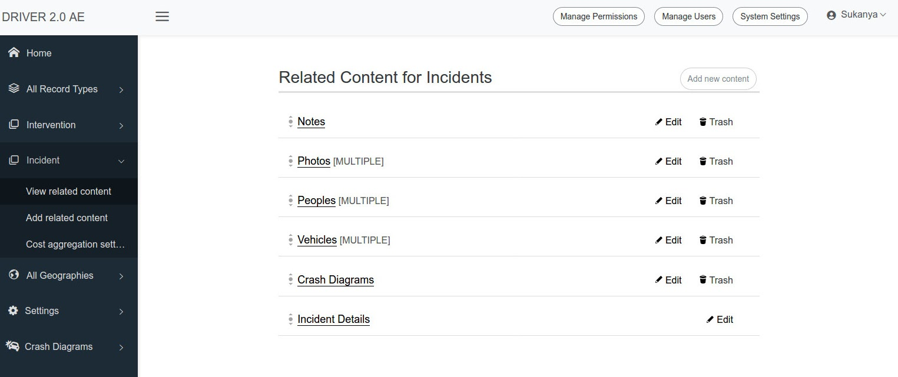

The Related Content for Incidents appears as the Incident Input Form in the User Panel. All the content added here reflects as it is in the Incident Input Form. Below is the screenshot of the Incident Input Form from the User Panel which depicts the same.

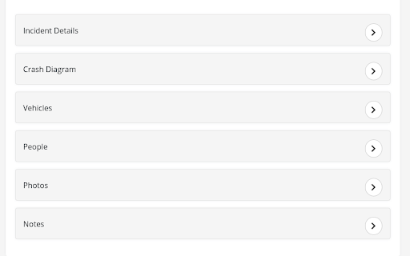

## Adding New Related Content Types

There are two ways to add new Related Content types.  One is to click ‘Add related content’ underneath the appropriate Record Type.  The other is by clicking ‘Add new content’ while viewing the list of Related Content for that Record Type.

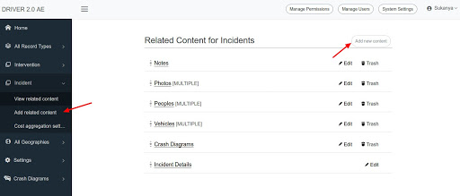

On the ‘Add New Related Content’ page, enter the singular and plural titles of the Related Content-type, as well as a description to provide additional information.  If a user should be able to enter a multiple of this type of Related Content, check the ‘Allow Multiple?’ checkbox.  For example, if multiple vehicles could be involved in an incident, the user will need to be able to record more than one vehicle, so the ‘Allow Multiple?’ checkbox should be checked.  Click ‘Save’ to save the new Related Content. Click ‘Cancel’ to exit the page and discard any changes.

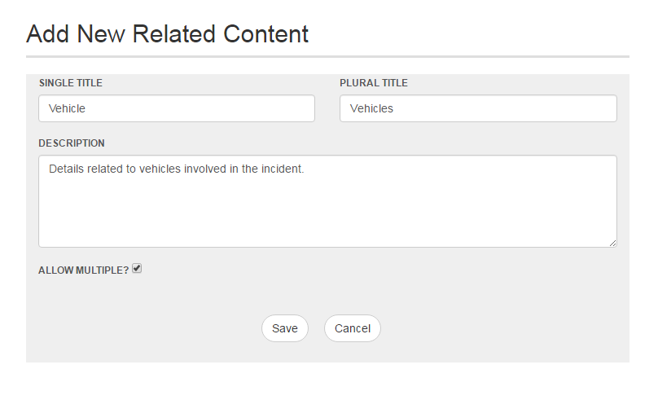

## Editing Related Content Types

Once a new type has been created, the fields and field types should be defined for the Related Content.  

1. To begin adding fields to the Related Content, click the ‘Edit’ link on the content to be edited.

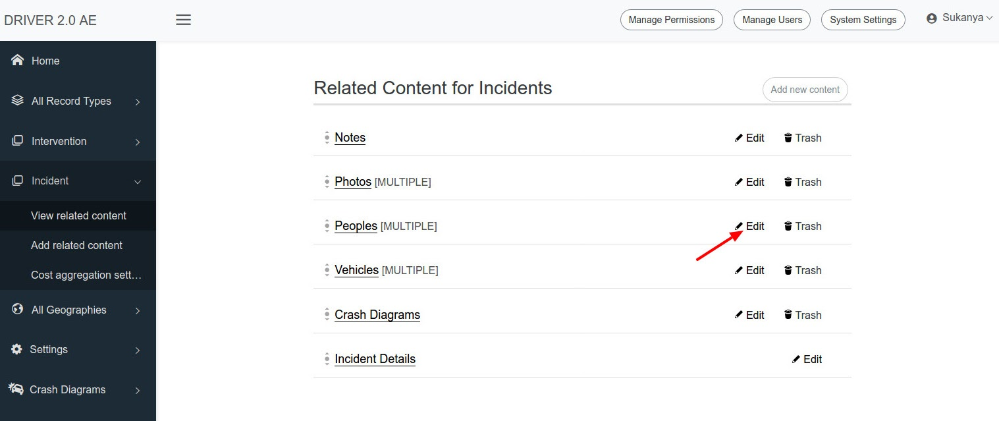

The following screen is where the structure for the data for that Related Content is defined.  This includes field names, field types, and the order of field display.  There are four main types of fields: Text Field, Select List, Image Uploader and Relationship.  Text Field and Select List also have options to specify additional constraints. Refer to the chart in Appendix A for descriptions of all field types and options.

When a related content type is just created, the edit page appears blank, as shown below.

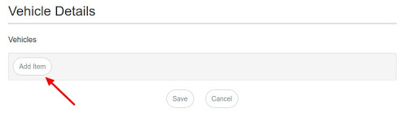

2. Click ‘Add Item’ to add the first field to the Related Content type
3. Add the necessary field types and options
4. Click ‘Save’ when finished to save the Related Content type.  

Saving updates the schema with the new data structure. These new fields and options show up immediately in the DRIVER application.

See the examples below for how to enter each field type.

### General Editor Options

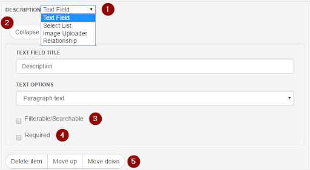

1. Drop-down to select the type of field. Field types are Text Field, Select List, Image Uploader, and Relationship.  See Appendix A for full descriptions and options
2. Collapse the options of the field. Intended to clean up the interface when many fields have been entered
3. Checking ‘Filterable/Searchable’ will make data from this field show up in searches
    1. Text Field – Data will be returned in keyword searches
    2. Select List – Data values will be filterable via a drop-down menu
4. Checking required makes the field required for entry.  A user will not be able to save a record unless all required fields are completed
5. Buttons that allow reordering or deleting of the field.  Moving the field up or down in the list will change its place in the order displayed to the user.  ‘Delete item’ removes the field.

### Text Field Options

The below image depicts the multiple text fields options which the Administrator can select while adding a text filed.

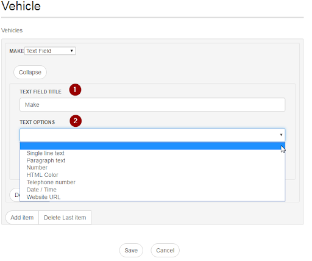
 

1. Title of the Text Field. The user will see this as the name of the field
2. The drop-down menu for options to select the type of Text Field. This drop-down changes the type of text field that is presented to the user.  See Appendix A for full descriptions of text options.

**Paragraph Text**

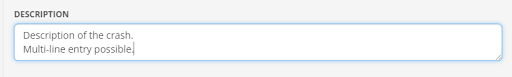

The above image shows that a user can add a multi-line text or Paragraph Text by selecting this field from the Text Options.

### Select List Options

**Schema Editor**

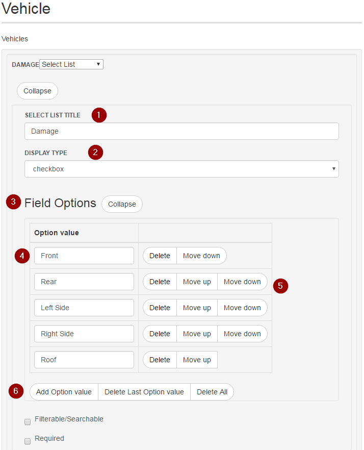

1. Title of the Select List field. The user will see this as the name of the field
2. The type of Select List to display. Select List has two options (see Appendix A for details):
    1. Select List
    2. Checkbox
3. Field options contain all the options that users are presented in the Select List.
4. Enter the name of options presented in the Select List.  Users can only pick from these options.
5. Buttons used to manipulate the fields and their order in the Select List.  ‘Move Up’ and ‘Move Down’ change the order of the option. ‘Delete’ removes the option.
6. Buttons to add another option value, delete the last option value, or delete all the values.

**Field Display**

**Select List**

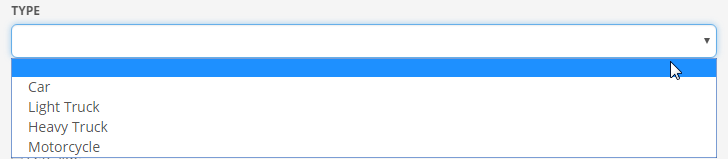

**Checkbox**

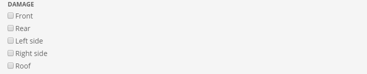

### Image Uploader Options

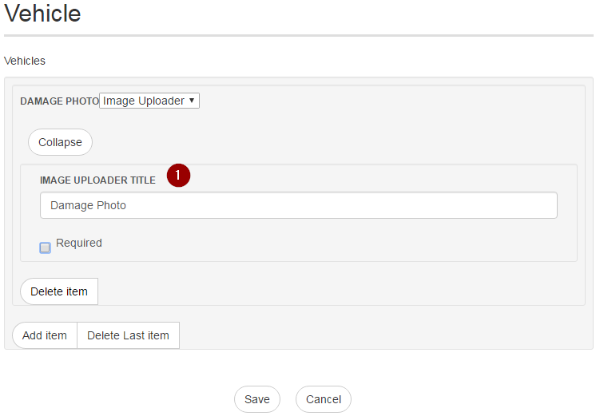

1. Title of the Image Uploader field. The users will see this as the name of the field.

**Field Display**

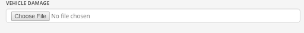

Cost Aggregation Settings

The Cost Aggregation Settings section allows the Administrator to add cost as per the Related Content Type added in the Schema. Once the Related Content Type is selected, the Administrator then needs to select the field for which cost aggregation settings are to be applied. After selecting the fields, dropdown(s) will come automatically which will allow the Administrator to add the cost of each field. Along with this, the Prefix and/or Suffix can also be added as per the requirement. These values will be calculated at the backend and will be shown under the “Total Economic Loss and Societal Harm” section in the User Panel.

# Intervention

Interventions are the road design and traffic control taken for road safety. It allows to understand some of the safety treatments, road lighting, speed limits, pedestrian treatments and road markings. Using Interventions, a rigorous approach can be taken to the selection of studies and calculation of benefits.

# Related content for Intervention

This user interface is used to add and organize the Intervention name. Here to standardize naming schemes for interventions/treatments across DRIVER, iRAP toolkit is being used. From the iRAP’s toolkit, instead of taking names (also called treatment names), the IDs are taken in this form so that in the future if some name changes (from iRAP’s side), it will automatically change in the user panel and the Administrator will not have to monitor it. The ID’s also referred to as treatment IDs are taken from iRAP.  These IDs can be viewed by clicking ‘View related content’ underneath the relevant Record Type on the left-hand side of the page.  The resulting page will show all of the Related Content types for the associated Record Type. Apart from this, the Administrator can also add a name to Intervention.

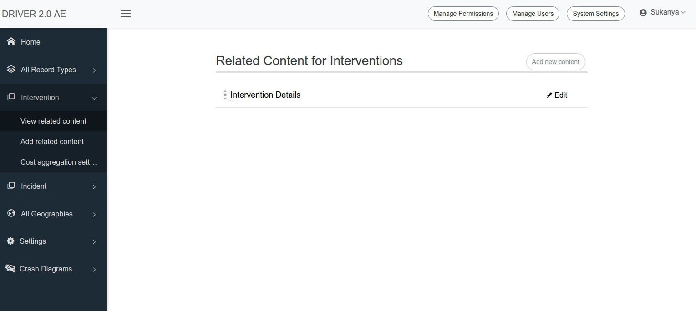

## Adding New Related Content Types

There are two ways to add new Related Content types.  One is to click ‘Add related content’ underneath the appropriate Record Type. The other is by clicking ‘Add new content’ while viewing the list of Related Content for that Record Type.

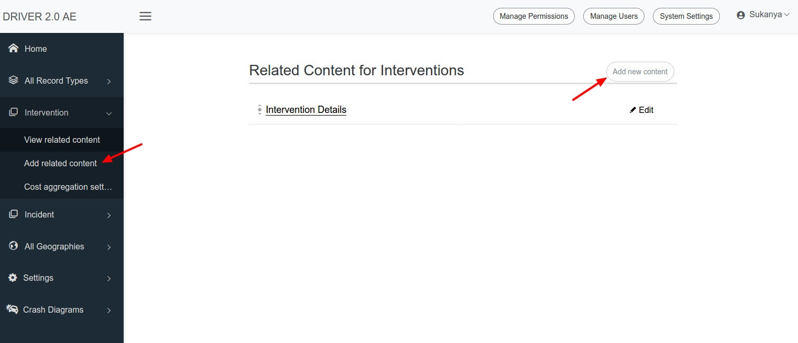

On the ‘Add New Related Content’ page, add the treatment ID from iRAP. If there is some custom name, add the name. Click ‘Save’ to save the new Related Content. Click ‘Cancel’ to exit the page and discard any changes. Below is the screenshot of the same.

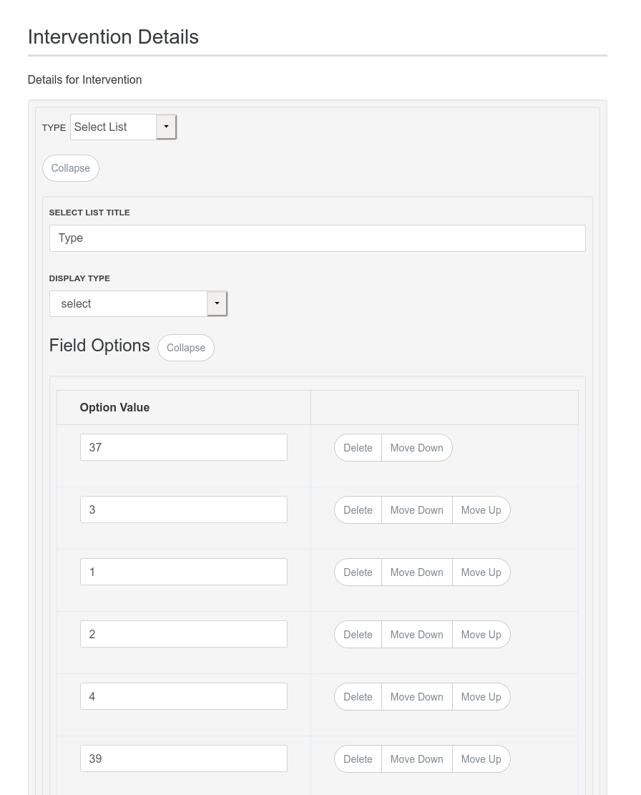

Preview

The Administrator gets an overview of the form from the Preview button. The Preview will help the Administrator get a view of how the form will look in the User Panel.

The below image shows the Preview of the Incident.

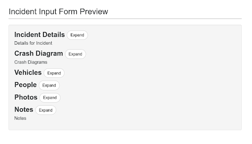

This functionality is to see a Preview of how the Incident Input Form will appear to the user in the User Panel.

The below image shows the Preview of the Intervention.

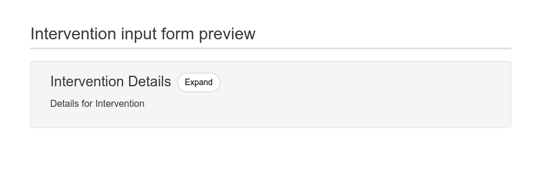

This functionality is to see a Preview of how the Intervention will appear to the user in the User Panel.

# Language

The DRIVER application allows the Administrators to add and edit a new language or some fields of the existing language.

The Administrator can see the list of languages using the “View all Language” tab in the Language section of the side navigation bar. Here, languages added for both Ashlar Editor (Admin Panel) and the User Panel can be seen. If the user wants to download any file, they can click on the name in the “file” column and the file can be downloaded. The default column tells which file is set as default i.e. the name against which true is displayed in this column, that particular language is set as the default language of the application. When clicked on “Edit”, the user will be redirected to the Edit page. Along with this, the “Delete” option is also provided. When clicked on this, the particular language will be deleted from the system. The Delete functionality is not applicable for the default language.

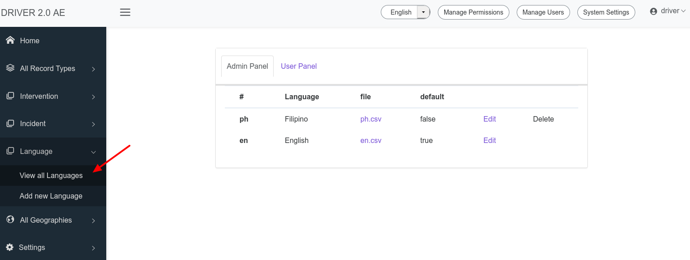

### Adding a New Language

This button allows the Administrator to add a new language to the system or edit an existing one. To add a new language, the Administrator has to select the panel i.e. Ashlar editor (Admin Panel) or User Panel, select the language, add the file, and check the check box if they want to keep this language as the default. A Sample File option is also provided, which will get activated upon selecting the Panel. This option allows the user to download a sample file for the particular panel. Once all the details are filled up, the particular language file will be uploaded to the system and will also appear in the dropdown as one of the languages for the users.

### Editing the Language

The Administrator can edit the details in the already existing language by selecting the panel, language, adding the file, and checking/unchecking the Default opinion.

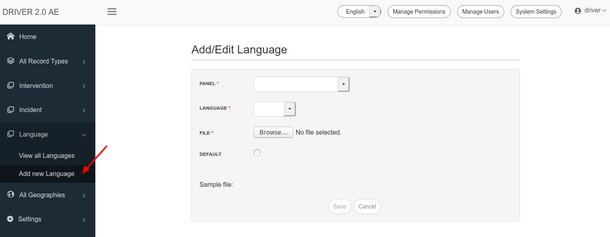

# Geographies

The DRIVER web application allows users to filter data by geographic areas.  The schema editor is where users are able to upload shapefiles (.shp file extension) to define the filterable geographic areas.  The list of geographies can be accessed from the left-hand menu navigation. 

### Adding Geographic Layers

Just like Related Content, click ‘View All Geographies’ to see the current list and ‘Add New Geographies’ or ‘Add new Shapefile’ to add a new geographic layer.

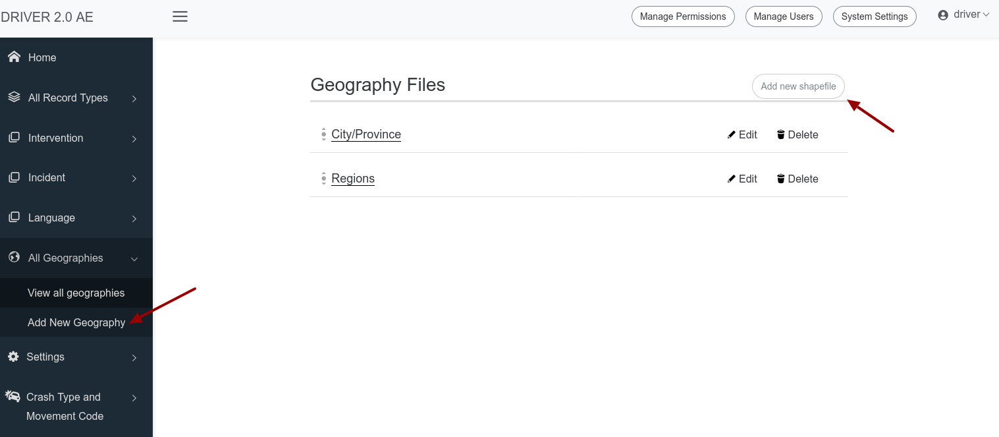

After clicking ‘Add new Shapefile’, the editor brings up fields to specify the details of the geography layer.  The editor also provides a dialogue box to upload the shapefile.  Because the shapefile format requires several different files to function properly, the files should be packaged into a folder and zipped.  

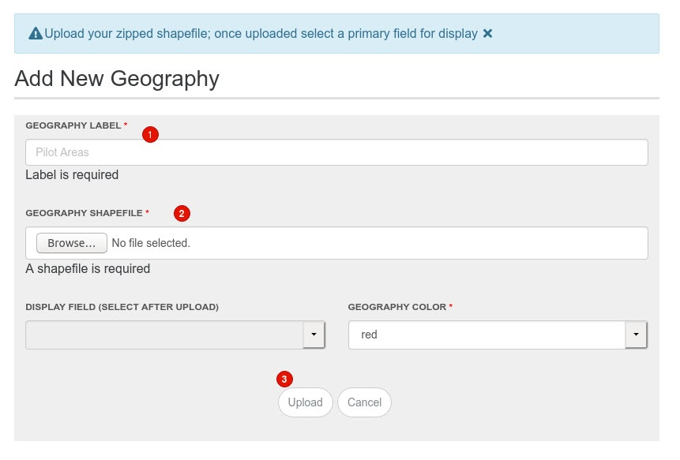

1. Enter a label for the geography layer.  This will display as the name of the geography layer on the Map view
2. Choose the zipped folder containing the shapefile with the dialogue box
3. Click ‘Upload’ to load in the shapefile

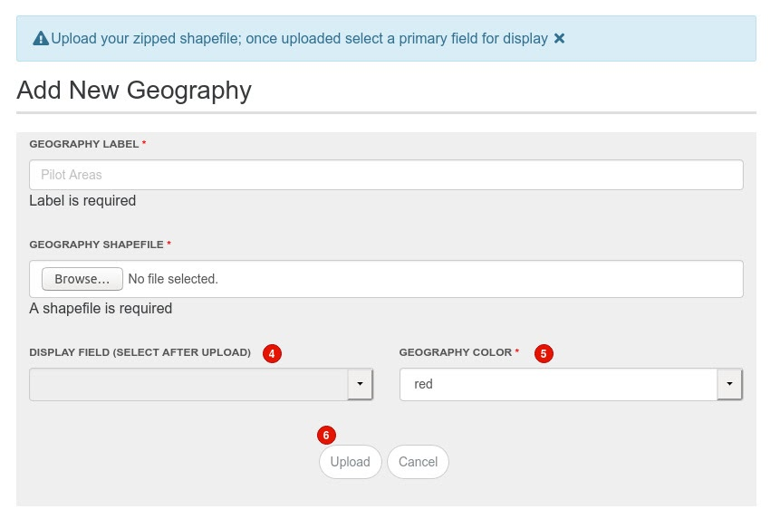

4. Select the proper field from the ‘Display Field’ drop-down menu (explanation below)
5. Select a color for the geography layer
6. Click ‘Upload’ finalize the addition of the geography layer

Uploading the shapefile is a simple six-step process. Geographic boundaries used for filtering are made up of smaller polygons. Those polygons need labels when they are presented to the user for filtering.  The Schema Editor takes a field from the shapefile to use as the label of the component polygons.  The first time ‘Upload’ is clicked, the editor loads all the shapefile’s fields and displays them in the ‘Display Field’ drop-down menu.   The values in the field that is selected in this drop-down menu will be used as the labels of the polygons.

For example, below is a boundary shapefile containing many smaller internal polygons. The window shows all the fields associated with the polygon highlighted in red.  

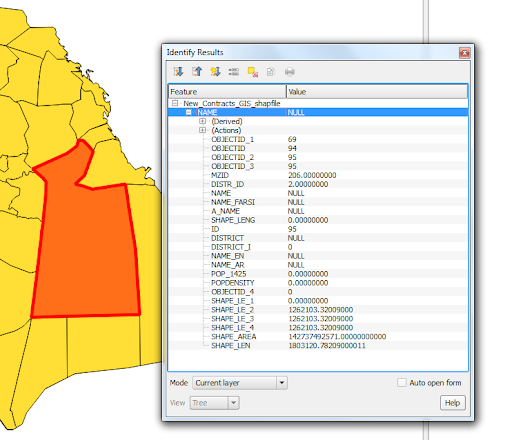

When the user clicks ‘Upload’ the first time, the ‘Display Field’ drop-down becomes active and shows all of the fields found in the shapefile.  The drop-down below contains the same fields as the table above.

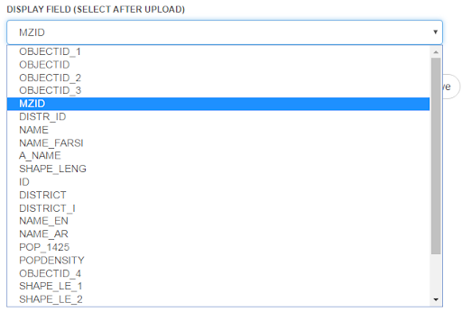

For this example, ‘MZID’ is used as the label of the field.  When the shapefile is loaded into the map view, the values in ‘MZID’ are used as the labels of the polygons.  As seen below, the value for ‘MZID’ is now used to filter the Maintenance Contract geography: 206 corresponds to the polygon selected.
 
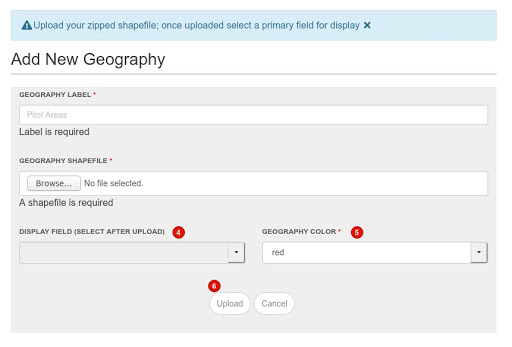

### Edit Geography

The Administrator can edit the geography by clicking on the “Edit” button against the geography name. Here, the Geography Label, Display Field (select after upload) and Geography Color can be changed but the Geography file cannot be uploaded.

### Delete

The Geography can be deleted by clicking the “Delete” button against the particular geography.

# Settings

The Settings tab consists of six main sub-tabs  i.e. City/Province, Change Country, Organization, Weather API, Duplicate Threshold and Bulk Upload. Below is a brief description of the same:

## City/Province

The Administrator can view a complete list of all the cities in this section. All the cities which appear here are added though the Shapefile uploaded through the Geography section. 

## Change Country

The Administrator can set the default country from the “Change Country” tab of the Ashlar Editor.  The country selected here shall be displayed on loading the Map, Incident Input Form.

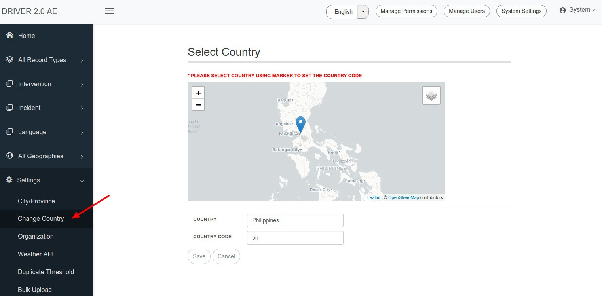

## Organization

The organization is an interface that allows the Administrators to view, add new organizations, as well as edit and delete the same. The Administrator can view all the organizations added to different regions under this section. The Administrator has the privilege to add/edit/delete the organization. The organization added by the Administrator can then be visible in the add/edit Manage User section, Role Request section in the User Panel. It is where the Organizations will appear in the system and the User or Administrator can select the same as needed.

### Add Organization

The Administrator can add the organization by clicking the “Add Organization” button at the top-right corner of the page. Here, the user needs to select a region from the dropdown and add the name of the organization for the selected region. These regions are added through the Geographic Boundaries. While doing so, the Administrator cannot add 2 same organizations under 1 region else the system will throw a message saying “Organization already exists”.  However, the same name can be given to the two organizations that fall under 2 different regions.

### Edit Organization

The Administrator can even change the name of the organization or can change the region to which the organization is being assigned. For this, the Administrator needs to click on the “Edit” button against the specific organization. On click of the “Edit” button, the “Edit Organization” form will be displayed and through here, the organization or region assigned to the organization can be updated.

### Trash

The Administrator can also delete the Organization by clicking the “Trash” button against the particular organization.

## Weather API

To gather the weather information automatically, a weather API can be used. In the current DRIVER application, OpenStack Weather API is being used. The API is a medium to fetch data (weather) from OpenStack and show it in DRIVER. This weather API when enabled, will gather the weather and light information automatically if the user has not added any details against the fields while adding the incident.

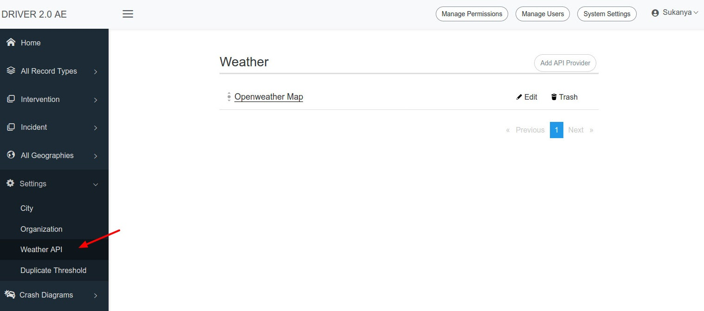

## Duplicate Threshold

The incidents that take place at the same location, date, and time are referred to as duplicate incidents. To calculate the geo-coordinates of the location i.e. up to what radius (of a location) the record should be considered as duplicate, a threshold is being set in degrees by the Administrator. The Administrator can update this duplicate threshold value through this interface. The value shown here is in degrees. A change here will reflect as a change in the calculation of the total threshold when a duplicate record is to be searched.

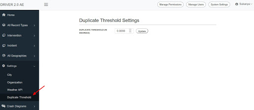

## Bulk Upload

The Bulk Upload feature allows the Administrator to upload the incidents and interventions in bulk and that too in a single click. It ultimately saves a lot of time as it allows to add multiple records at a time. To access this feature, the Administrator just has to click on the “Bulk Upload” tab under Settings in the Navbar. This will open a new page wherein the Administrator will first see a list of all the files uploaded either for Incident or for Intervention with their status and data of upload. This page also has a feature called “Upload Bulk Data” which allows the Administrator to upload the CSV for Incident or Intervention. If they do not have a sample format, they can even download it by clicking the “Download sample file”  link which appears after selecting either Incident or Intervention. 

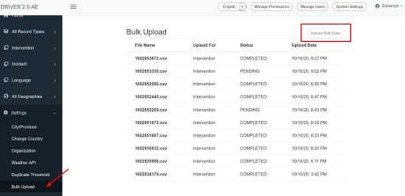

Once a file is being uploaded by the Administrator, it will be validated by the system. If any validation error is found out in this process, the same will be reported to the Administrator through a CSV error log file. The Administrator now needs to fix all the errors and upload the file again. Once uploaded successfully, the status of the file can be seen on the Bulk Upload Page as Pending. To upload all these records to the system a cron is set up on the server-side, which will periodically fetch these Pending records and update the records to the system. When the records are added successfully to the system, the status of the file can be seen as Completed.

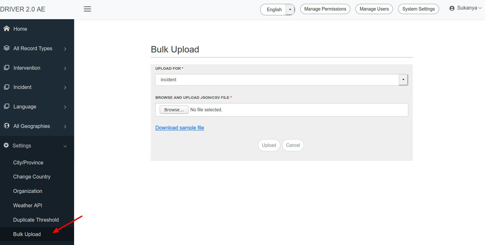

# Crash Type and Movement Code

A Crash Type is a way to classify crashes using standard names whereas  Movement Code is a system of classifying crashes using standard and predefined diagrams based on road users and their movements and activities leading to a crash.

The interface provides an ability to add details of the Crash diagram. For this, the Administrator needs to add the fields of the Crash diagram in the Incident schema.

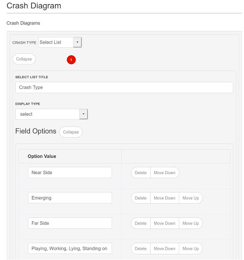

1. Add Crash Type as a select list and add the relevant options to it.
2. Add “Movement Code” as a text field (shown below screenshot).
3. Add an “Image” of the Crash Type which will be an Image uploader (shown below screenshot).

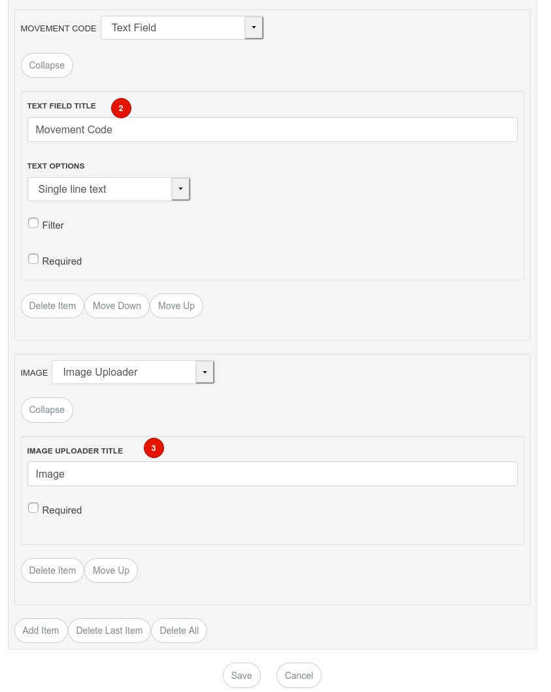

Once the schema is created, the Administrator can add Movement code and Crash Type Images. For this, an interface called “Crash Type and Movement Code” is provided. On click of “View of Crash Types” which falls under Crash Diagram, a list of all the Crash Types can be seen.

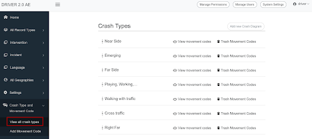

The Administrator can add a new crash diagram for the Crash type by clicking either the “Add New Crash Diagram” button on the top right corner or can click on “Add new movement code” in the side nav. This will redirect to an interface called “Add Movement Code” wherein the Administrator will have to Select the appropriate Crash Type, add movement code and images to the same.

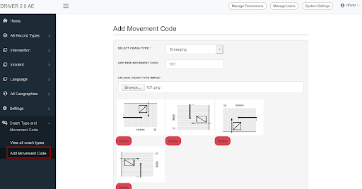

The Administrator also has the ability to edit these crash diagrams/movement codes by clicking in the “View Movement Code” button against the particular Crash Type. First, a list of movement codes will be displayed and the Administrator can go and edit against the same.

# Language

The DRIVER application has a functionality that allows the users to view the application in their preferred language. There is a dropdown in the header which contains a list of languages. Users can select any preferred language from this list and the whole application will be transformed into that language. Whenever a new language is added (through the “Language” tab), it will reflect in this dropdown as well.

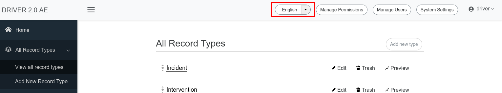

# Manage Permissions

The Ashlar Editor includes a design to manage the permissions/roles of the user. For this, there is a “Manage Permissions” button near the top of the page. Clicking this button will display a list of DRIVER groups that can be assigned to a new or an existing user. The Administrator can add a new permission/role, edit an existing permission/role, and can also delete the permission/role. 

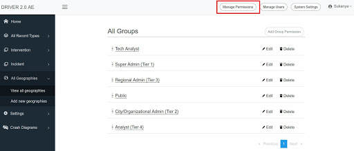

## Add Permission

To create a new group/permission, the Administrator needs to click on the “Add Permission” button, which brings them to an interface with a new user form. The Administrator needs to add the Group name, enter the description and also select the appropriate permissions. Instead of adding a complete set of permissions, the administrator can also give particular permission to a particular group.  Along with this, if the administrator is creating a group for the other Admin, the “Administrator Access” checkbox needs to be checked.

For Eg. If the Administrator wants to give only the “View” access for records to the Public group then in the records row, the Administrator needs to check the “Can View Record” option. In this case, the Public group cannot Add, Edit or Delete the record but just has the access to view it.

## Edit Permission

The Administrator can change the already assigned permission to a specific group by clicking on the “Edit” button against that particular group. But while doing so, the Administrator cannot give an already assigned group name, or else the system will reply with an error saying “Permission already exists .”

## Delete

The Permission can be deleted by clicking on the “Delete” button against the specific permission group. If some permission is deleted, the users to whom the permission is assigned will not be able to login to the system.

# User Management

The Ashlar database design interface includes tools for managing users. Users may register via a single sign-on integration (currently with Google), or an administrator may create a user and send them a temporary password.

## Managing Users

If an administrator is logged into the Ashlar editor, there is a “Manage Users” button near the top of the page. Clicking this button will display a complete list of users. From this screen, the administrator may filter by user type, edit user information and role, view more details about a user, or delete the user.

### User Roles and Permissions

User Roles and Permissions is a completely customizable functionality. By default, there are six roles of permissions currently added in DRIVER. Roles and permissions were defined in order to provide different levels of functionality to different types of users. Along with this, the Administrator has the complete authority to add/edit more user roles and permissions. 

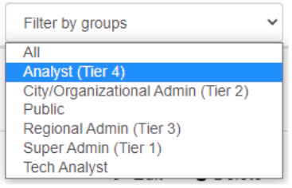

### SuperAdmin (Tier 1)

The SuperAdmin role has access to all the functionality in the application, including login capability to the database design editor software. SuperAdmins can modify the structure of the database, add new fields, make fields required, upload geographic boundaries, manage users, manage permissions, and manage organizations. In DRIVER, SuperAdmins may export user access logs for analysis.

### Regional Admin (Tier 2)

The Regional Admin has access to create new users and set access privileges for them. They can grant/revoke/modify the user’s access privileges. The Regional Admin has the ability to manage duplicate as well as manage the records i.e. add/edit/delete the record. They can also view the specific location’s confidential data.

### City/Organizational  Admin (Tier 3)

The City/Organizational Admin can create a new user and can set user access privileges. This level of Admin has access to grant/revoke/modify the user access privileges. The City/Organizational Admins can also manage duplicates as well as manage records i.e. add/edit/delete the record. They also have the privilege to view the specific location’s confidential data.

### Analyst (Tier 4)

The analyst role includes permissions to view and edit all data in DRIVER. Analysts may add, edit, and delete incidents and interventions, and have access to all event information, including details associated with an incident such as people and vehicle information.

### Tech Analyst (Tier 4)

The Tech Analyst can view the database and analytics but cannot modify the data.

### Public (Tier 5)

Public users may register to view basic incident data. They may not edit any data, and can not view a person or vehicle information.

## New Users 

To create a new user, the administrator simply clicks the “Add new user” button, which brings them to an interface with a new user form. Enter the first name, last name, username, email address, choose an appropriate role (driver group), mobile (optional), password, and select the geography. Along with this, there are four checkboxes i.e. Administrator Access, SuperAdmin Access,  Analyst Access, and Tech Analyst Access. 

When a user is marked as “Administrator Access”, the user can access the Ashlar Editor but is not the Super Admin. The user marked as “Administrator Access” and “SuperAdmin Access” is the SuperAdmin. 

If a user group “Analyst” is to be selected while creating the user, the checkbox “Analyst Access” should be marked against it. If a user group “Tech Analyst Access” is to be selected while creating the user, the checkbox “Tech Analyst Access” should be marked against it. The Administrator can select either “Analyst Access” or “Tech Analyst Access” depending on the user role. Both the checkboxes cannot be selected at a time. 

After creating the user with this method, the administrator must alert the user about the credentials. Single sign-on integration is preferred for increased security.

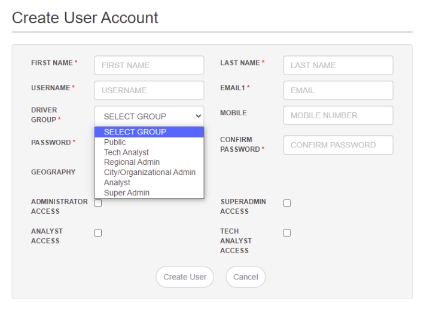

Edit Users

The Administrator can any time update the details of the user by clicking the “Edit” button against the particular user’s email address. The fields like the first name, last name, email, username and driver group are compulsory fields while the others are optional fields. While editing, the username and email are unique fields i.e. if the Administrator tries to add existing data in these two fields, an error message will be thrown by the system which will stop the Administrator to save the details. Administrators may also change the role of an existing user. For example, the user registers with a Google account and they are automatically granted a “Public” role. An administrator may elevate them to “Analyst” or “Admin” roles at that point.

Delete

A user's account can be deleted from the system by clicking on the “Delete” button against the user's email address.

## Requested

Whenever a user has requested to change their role from the User Panel, a “Requested” button will be displayed after the user’s name in the “All Users” list which falls under the Manage Users section. 

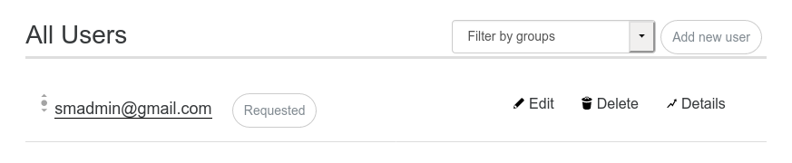

When the Administrator clicks on the “Requested” button, they will be redirected to a page wherein all the details of the user who has requested for the role are listed (viz. Full Name, User Name, DRIVER Group (i.e current driver group), Requested Group (group requested by the user through the User panel), Current City, Requested City (if applicable), Current Region, Requested Region, Current Organization and Requested Organization). Along with this, there are four checkboxes i.e. Administrator Access, SuperAdmin Access, Analyst Access and Tech Analyst  which the Administrator needs to select while Approving or rejecting the newly requested role. The Administrator now has the choice to either approve or Reject the role.

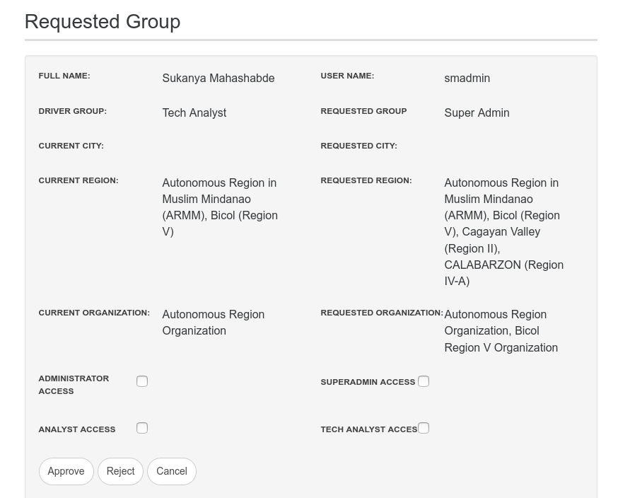

For eg. A Tech Analyst user wants to elevate their role to SuperAdmin, the user has sent a request from the User Panel hence, a requested button is appearing before the particular user’s name in the Manage users section. Now the Administrator can view the details of the user and if willing to approve the request, has to select the “Administrator Access” and “SuperAdmin Access” checkboxes and click on the “Approve” button.

If the Administrator wants to reject the request, they can simply click on the “Reject” button. Also, if the Administrator does not want to take any action on the request they can click on the “Cancel” button and the request will be in the pending state till some further action is taken by the Administrator.

# Statistics Configurations

## Black Spots

The black spot configuration consists of inputting a threshold for the percentile of locations to display. The percentile is relative to all road segments and is represented as a decimal between 0 and 1. Lower thresholds display more black spots; higher thresholds display only the most severe black spots. Updating the threshold does not have an immediate effect in DRIVER, but the update will be visible after the next scheduled run of the black spot calculation script.

To access the black spot configuration, click the “System Settings” button at the top right of the Ashlar interface. Then set the severity threshold and click “Update”.

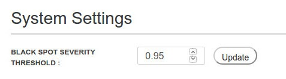

# Appendix A: Field Types, Options and Descriptions

<table>
  <tr>
   <td><strong>Field Type</strong>
   </td>
   <td><strong>Type Options</strong>
   </td>
   <td><strong>Description</strong>
   </td>
  </tr>
  <tr>
   <td rowspan="7" >Text Field
   </td>
   <td>Single line text
   </td>
   <td>Allows free-form entry of one line of text.  The text includes alphanumeric characters and symbols.  Good for a short string of characters or a short description. Examples: license plate number, street address
   </td>
  </tr>
  <tr>
   <td>Paragraph text
   </td>
   <td>Allows free-form entry of multiple lines of text.  Good for a longer text description.  Example: notes, insurance info
   </td>
  </tr>
  <tr>
   <td>Number
   </td>
   <td>Allows entry of any length of numerical characters.  Good for fields that require only numbers. Examples: year, number of fatalities
   </td>
  </tr>
  <tr>
   <td>HTML Color
   </td>
   <td>Brings up a color picker for entry of computer-readable (HTML) color information.  Good for colors. Example: vehicle color
   </td>
  </tr>
  <tr>
   <td>Telephone number
   </td>
   <td>Allows entry for a telephone number. On HTML5 enabled devices, this prompts the user with a dial-pad for entry.
   </td>
  </tr>
  <tr>
   <td>Date / Time
   </td>
   <td>Allows entry for a date/time value.  On HTML5 enabled devices, this prompts the user with a calendar and clock to pick the date/time values.
   </td>
  </tr>
  <tr>
   <td>Website URL
   </td>
   <td>Allows entry for text for a website URL.  When the text for the URL has been entered, a hyperlink on the text is created and viewable from the record view page. This link can be used to go directly to the link that was entered.  Use for any website links.
   </td>
  </tr>
  <tr>
   <td rowspan="2" >Select List
   </td>
   <td>Select
   </td>
   <td>Creates a drop-down list of pre-defined options for the user to select from.  The user can only select one of the options from the drop-down.  Good for creating a discrete list of items that need only one selected.  Examples: Road type, vehicle type
   </td>
  </tr>
  <tr>
   <td>Checkbox
   </td>
   <td>Creates a list of checkbox items for the user to select from The user can select any number of options from the list.  Good for creating a discrete list of items that can have multiple selections.  Examples: road assets damaged, vehicle parts damaged
   </td>
  </tr>
  <tr>
   <td>Image Uploader
   </td>
   <td>Image Uploader
   </td>
   <td>Creates a dialogue box that can be used to upload images to the record. Images can be added from local storage on a hard drive or from a mobile device’s camera.
   </td>
  </tr>
  <tr>
   <td>Relationship
   </td>
   <td>Relationship
   </td>
   <td>Creates a relationship between the item and another item from another Related Content type that has already been entered into the record.  A drop-down list is created to select from the entries in the other Related Content type.  Good for creating relationships between items where they need to be assigned to one or another.  Example: a relationship between a person and their vehicle
   </td>
  </tr>
</table>

