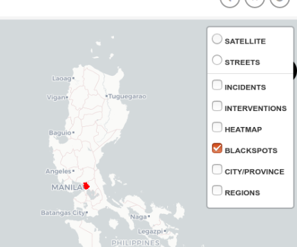
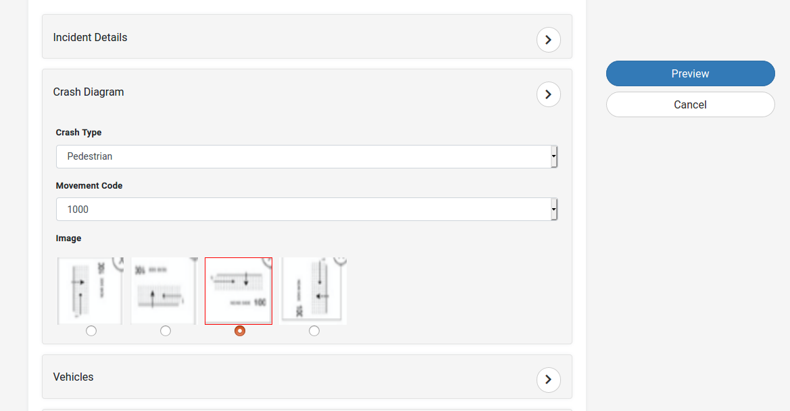

**Introduction**

This document provides usage instructions for the DRIVER application. DRIVER is designed to collect and analyze data about traffic crashes that occur at a particular place. The application provides data entry tools, graph and map interfaces, custom report and filter tools, multiple concurrent user editing, and data exports.
This is a draft document and is subject to revisions.

**Authentication and User Management**

DRIVER provides two options for logging in to the application: a username and password pair, or single sign-on (SSO). Multiple SSO providers may be configured in the software, and it comes by default with Google account integration. Along with this, if some new user wants to login without using the Google account, they can create an account into the system.

**Single Sign-On**

If users have a Google account, they can click on the “Login with Google” button. This process redirects the user to the Google authentication page wherein they have to enter their valid email address and password, and after a successful login, redirects back to DRIVER with the user’s credentials.

**Username and Password**

Administrators may create username and password pairs for users to log in. This approach requires an administrator to be available for user registration support.

**Create an account**

A new user can always access the system by creating an account. To create a new account, the user will have to click on the “Create an account” button. On click of the button, a popup will open up where the user needs to fill out the details like first name, last name, username, email address and add a password. The mobile number here is an optional field. The username and email address should be unique else the system will not allow the user to proceed further with the registration process. Once the user fills out the details and clicks on the “Register” button, the user will be redirected to the Dashboard (viz. the Homepage). The user will be registered as a public user.

**User Roles and Permissions**

There are six roles with differing permissions in DRIVER. Roles and permissions were defined in order to provide different levels of functionality to different types of users. A country can anytime design its own access policy and permission. The user roles and permissions are created by the Administrator through the Ashlar Editor. By default, DRIVER has six roles with differing permissions as defined below:

*SuperAdmin (Tier 1)*

The SuperAdmin role has access to all the functionality in the application, including login capability to the database design editor software. A SuperAdmin can modify the structure of the database, add new fields, make fields required, upload geographic boundaries, and manage users. The database design editor software will be covered in a separate user manual. In DRIVER, SuperAdmin may export user access logs for analysis.

*Regional Admin (Tier 2)*

The Regional Admin can create new users, can manage the duplicates, can add/edit/delete records, can view the confidential data and upload map data and bulk data at the regional level.

*City/Organizational Admin (Tier 3)*

The City/Organizational Admin can create new users, can manage the duplicates, can add/edit/delete records, can view the confidential data and upload map data and bulk data at the city level.

*Analyst (Tier 4)*

The analyst role includes permissions to view and edit all data in DRIVER. Analysts may add, edit, and delete incidents and interventions, and have access to all event information, including details associated with an incident such as people and vehicle information.

*Tech Analyst (Tier 4)*

The users having the role of tech analysts can view the database and analytics but cannot modify the data.

*Public (Tier 5)*

Public users may register to view basic incident data. They may not edit any data, and can not view a person or vehicle information.

**View Interfaces**

There are three primary interfaces in DRIVER, each of which provides different ways to analyze and view incident data. The three interfaces are linked in different ways and rely on options chosen in the header that is visible on every interface. The map and record view interfaces rely on options shown in the filter bar, which is immediately beneath the header.

**Dashboard**

The dashboard interface is the default view after logging in. This interface includes a summary and overview information about the data in DRIVER.

The dashboard has several default settings to provide a quick analysis of recent events.
Below is a brief description of the same.

1. On click of Dashboard, a drop down appears which shows a list of interfaces. It is through this dropdown, the user can navigate to the other interface.

2. City/Province and Regions - A user may set their city/province or region default in the header bar. This could be a city/province or region in the country, or any smaller subset according to geographic boundary data loaded into the application. The city/province or region chosen will filter the maps, ToDDoW chart, and widgets to provide data for incidents that occurred only within that geographic boundary. This default setting is preserved between user sessions on the same computer.

3. This icon will open a list of languages in the dropdown. Users can select any preferred language from this list and the whole application will be transformed into that language.

4. This is through where, user can access various details eg. Account information, role request, audit logs and duplicate records.

5. Black Spots by Severity - The user can view all the Black Spots in this section. It also provides the user with a link at the bottom which when clicked will navigate to the Map page and show the Black Spots on the Map.
   
6. Incidents: Last Two Weeks shows the incidents which have occurred during the last 2 weeks. It also provides the user with a link at the bottom which when clicked will navigate to the Map page and show the Incidents on the Map.
   
7. Total economic loss and societal harm: Last 90 days has the value of the loss that took place in the last 90 days. On clicking this tab more details about the same are shown to the user.
   
8. Incidents by default show the Incident count of the last 30 days. It also allows the user to see the incident count of the last 90 days and 365 days.
   
9. Time of Day Day of Week: Last 90 Days - The Time of Day, Day of Week (ToDDoW) chart shows the concentration of incidents over the last 90 days. This chart has a color range where the light color square incidents fewer crashes whereas the darker color square indicates a high number of crashes. Users can hover on a particular square and can see the event count i.e. the number of events that took place on a particular day.
   
10. The Saved filter section is used to save a filter. Instead of applying a filter, again and again, the user can save it from the Map or Record list page and can then further use it as required. It has a button called “View” on click of which, the user is navigated to the Map page and the specific filter gets applied and incidents are fetched accordingly.

**My Account**

The “My Account” section contains the account information of the user logged in into the user panel. The account information consists of first name, last name, username, email address, user group and the  Administrator status.

**Role Request**

A user can request the Admin user to change the current role and grant a new role instead to access the DRIVER application with more permissions. The user simply needs to click on the “Role Request” button and select the DRIVER group for which the user wants to request. Along with the DRIVER group, the user also needs to select a geography i.e. City/Province or Region and then according to the selected geography select either the city or the region and organization. Once a role request is sent, the user cannot change or revert it unless it is either accepted or rejected by the Admin user. Once the role request is accepted/rejected, the user will be communicated about it through an email.

In the image below, a public user is requesting to change its role to “Analyst” and has selected the geography as City/Province.

The SuperAdmin is the only group that cannot request for a role as the SuperAdmin being the highest role. The other groups can anytime request to change their roles.

**Duplicate Record Management**

Occasionally, two users may input the same incident. DRIVER has a process that runs on record creation to identify potential duplicate incidents. The first step to prevent a duplicate entry is the record/incident input form itself. When incidents time, date and location matches with an already existing incident a popup window will be shown to the user. Below is the screenshot of the same.

In this popup,  the users can see the details of the already added incidents by clicking the “View” button. The “History” button will show the complete history of the record if any changes are made to it by any user; else only the current record details can be seen in history. Also, the “Edit” button will allow the user to make changes to an already existing record.

Once the user saves the incident, they can see its entry in the “Manage Duplicate Records” section. The duplicate records might take some time to reflect in the section as it is based on the cron which is a time-based program that runs after a specific interval of time. Currently, the cron is scheduled to run once every day. Admin users may access an interface to identify and resolve the duplicates.

After choosing to resolve a potential duplicate, the users are presented with data from each record and may choose ”Use this Record”, “Mark as unique”, or can even select the fields amongst multiple records.

When clicked on “Mark as Unique”, the particular record will be disabled. Mark as Unique means the specific record is not a duplicate and the fields under it will be considered as unique.
When a user clicks on “Use this Record”, it will allow the user to select all fields under that record. This means that the fields of the other records will be considered as duplicates. The user can also choose freely between fields (only 1 field amongst all the options). If the user wants to select a field from one record and another field from a different record they simply need to click on the fields. If all options for a particular field are blank, then the user need not click on the blank field. This blank field will remain blank in the newly updated record. If the user misses a field even if 1 or more of the options are not blank, then the user will not be able to save the record. When the user clicks “Save” the label of the fields which are not selected will be highlighted in red color.

When a record is saved, it will create an altogether different record using these merged fields. On the record history page, a “Merged” button will be seen against the records which are resolved from the duplicate list. The user can click on the merge and can view the original details of the records.

**Download Audit logs**

Admin users can click on their username in the top right of the screen to view access logs. A modal window will appear that allows the user to choose the month and year of access logs to download. Logs include the date and time an incident was added or modified, the username and a link to the incident view page.. A user with sufficient permission (viz. the Admin users SuperAdmin, Regional Admin and the City/Organizational Admin) can download the audit of the incidents/crashes from the DRIVER application. The users can view the record of any month and year just by selecting the particular fields from the dropdown. On click of “Download CSV”, a CSV file will be downloaded which will have all the details of the incidents/crashes. This CSV file will contain the date of the incidents/crashes recorded while entering the information, the username of the user who entered the data, the action is undertaken i.e. whether the incidents/crashes were created, updated, or deleted. Along with this, a record_url field is also present which contains the URL of the incident. If the user wants to view a particular incident they can simply paste the URL in the browser and the incident details will be shown to the user.

**Map**

The map interface is one of the most data-rich views in the application. Users can easily navigate to this page by clicking on the name “Map” which appears in the dropdown when clicked on “Dashboard” in the top Menu bar. The Map page  contains a variety of layers, a full set of available filter tools, and access to interventions, additional graphs, custom report builder tools, and data exports. 
This interface allows the user to zoom in and zoom out using the “+” and ” -” buttons shown on the top left-hand side of the page. The user just has to click on these buttons and the map will be either zoomed in or zoomed out based on the selection of buttons. The zoom in and zoom out feature allows the user to see the map with more details. Along with this, the Map page also provides the users with a set of polygonal tools (i.e. polygon and square) which are located on the left-hand side of the page. Using these tools, users can draw a square or polygon in the required area and can take necessary actions accordingly. These tools get activated when the user clicks on them and starts drawing square/polygon on the Map. To edit or delete the drawn square/polygon, the user can click on the edit/delete options just below the polygonal tool and the same will reflect on the Map.

**Viewing Street-Level Photos**

On the Map page, when a user clicks on an incident in the Map, a popup will appear. This popup contains a street-level view of Mapillary along with basic incident details. Mapillary is a street-level imagery platform that scales and automates mapping using collaboration, cameras, and computer vision. It enables the visualization of the world using combined images from crowd-sourced images from any camera.

If data is available, the street-level view is shown in the image. If the data is not available then in this case, the Mapillary data within a radius of “1000 meters” is searched and displayed to the user. If still no Mapillary data is found in the “1000 meters” radius then a popup showing “No data found ” will be displayed to the user. At the bottom of the popup, there are two buttons i.e. “View” and “Edit”. These buttons functionality and visibility depend entirely on the permission or the group through which they are already logged in.
Along with this, the image shown in the popup has an arrow. When clicked on this arrow in the middle of the Mapillary photo, it allows the user to move in the image and see the interactive image of the picture uploaded. This popup also has a link called “Show Mapillary Street view” on click of which the user will be redirected to a new window wherein all the details of the incident/record will be displayed. These details are based on the permission or the group of access. Eg. The SuperAdmin can view all the details while the Public user can view only the Incidents Details. All the other details like Vehicles or people involved in the crash will not be visible to the public user.

**Address Search on Map**

For users’ convenience, an address search bar is added to the menu of the map. This address search bar will get activated once either the name of City/Province or Regions is selected by the user.
For eg. If the user selects City/Province and then selects Manila as the city, then in this case the address bar will be enabled and the map will have all the incidents in Manila. Now the user can search for the location (address) of the incident in the auto - search bar.

**Layers**

Toward the top right of the map panel, there is a layer switcher tool. DRIVER 2.0 shows a default list of native layers (i.e. street and satellite layers) and includes additional geographic boundary layers as they are loaded into the application. The default base map is drawn from OpenStreetMap data. There are both point and heat map style layers to represent incidents.

*Incidents*

To view the Incidents, the user has to select “Incidents” from the layer on the Map page. By default, when the page load incidents will be selected and will appear as blue dots on the Map.

*Intervention*

Interventions are the road design and traffic control taken for road safety. It allows to understand some of the safety treatments, road lighting, speed limits, pedestrian treatments and road markings. Using Interventions, a rigorous approach can be taken to the selection of studies and calculation of benefits. To see the interventions, the user has to click on “Intervention” from the layer and small green dots will appear on the screen.

*Heatmap*

Heatmap is a phenomenon used to show the intensity of crashes occurring at a particular spot. The higher the intensity of crashes, darker will be the color shown on the map. To see the heatmap, the user has to click on “Heatmap” from the layer.

*Blackspots*

Black spots are sections of roadway or intersections that experience an unusually high number of traffic crashes. To see the blackspots, the user has to click on “Blackspots” from the layer.

*City/Province*

This can be seen as per the geography added by the Administrator in the Ashlar Editor. To see the blackspots, the user has to click on “Blackspots” from the layer.

*Regions*

This can be seen as per the geography added by the Administrator in the Ashlar Editor. To see the Regions, the user has to click on “Regions” from the layer.

*iRAP*

The iRAP star Rating Layer allows the users to view the star rating using the DRIVER 2.0 application. The user can access this feature by clicking on the iRAP icon at the right on the Map page. This allows the user to either sign in using the already registered iRAP details or register to iRAP to access this functionality.  Along with the sign-in and registration options, this also allows the user (already registered ones) to reset their password using the iRAP’s official website.

The iRAP star Rating Layer allows the users to view the star rating using the DRIVER 2.0 application. The user can access this feature by clicking on the iRAP icon at the right on the Map page. This allows the user to either sign in using the already registered iRAP details or register to iRAP to access this functionality.  Along with the sign-in and registration options, this also allows the user (already registered ones) to reset their password using the iRAP’s official website.

The only thing new users have to do is click on register and the user will be taken to iRAP’s official website where they can register and create their account. Upon registration, the user can come back and sign in using the valid details and can access the iRAP star rating feature. Also, if a registered user has forgotten their password they can reset it by using the “Forgot Password” functionality on the popup. It will also redirect the user to iRAP’s official website where they can reset their password. Once the password is reset, the users can come back and enter the valid details. They can thus use the iRAP Star Rating Layer feature.

Once the user is logged in they can see the datasets assigned to them. At least one of the datasets needs to be selected to enable this feature on the Map. Users may select the dataset and click on the “Search” button to enable the iRAP Star Rating Layer’s functionality. Users can choose any number of datasets they want to view on the Map. Along with this, the users can also select the iRAP user group i.e. Bicyclist, Motorcyclists, Vehicle occupants, or the Rating type viz. Smoothed, Raw, or SRIP implementation like Before, After, etc. to get the relevant results from iRAP. When clicked on “Search”, an iRAP Star Rating Layer will be generated wherein the user will get two(2) tabs  in which they will find the Star Rating Details and the Road Features.

At the bottom left corner of the page, there is a tab that expands to display graphs. Users may toggle between graph styles using the button at the top right of the chart. The data loaded into the graphs is controlled by the currently applied date range and filter set, including geographic filters.

There are two types of graphs. One is a ToDDoW graph similar to the one on the dashboard. The only difference is that the data is filtered according to what the user sets. The second graph is the total number of incidents over time, aggregated by week. Both graphs provide interactivity on mouse hover.

Along with this, there is a third option called custom graph. Custom graphs allow the user to select the filters on X-axis and Y-axis. Based on the filters the graph is generated.

On click of “Custom Graph”, a bar graph with the selected filters will be generated. A user can also view the same filters in Pie chart view by clicking on the “Switch to Pie Chart”. This tab also allows the users to download this data in the form of an image by clicking on the “Export” button.

 

**Exports**

Data on the map may be exported as a set of CSV files. DRIVER data is stored in a relational database that supports many-to-one relationships. This means that for a given incident, there may be many people and vehicles involved. The export CSV zip file contains a CSV for each type of related object, linked to the primary accident table via a unique ID. The CSV files also contain the latitude and longitude for the incident location. These files may be further analyzed using a Geographic Information Systems (GIS) platform, spreadsheet, or database software.

Along with the CSV, DRIVER also provides the option to view the details using a custom report. Custom Report allows the user to filter out and view the data. The filtering is done based on the options added in the Incident Input Form. The below image shows the popup to generate the custom report.

**Intervention**

nterventions are the road design and traffic control taken for road safety. It allows understanding some of the safety treatments, road lighting, speed limits, pedestrian treatments and road markings. Using Interventions, a rigorous approach can be taken to the selection of studies and calculation of benefits. The intervention icon is only visible to the Administrators and Analysts. These users can add an intervention using the “Add Intervention” link. The added intervention can be exported in a CSV file. While adding an intervention, the types which come in the dropdown are the treatment IDs gathered from the iRAP. When exported, the treatment name will also have a treatment ID prefixed to it which is taken directly from iRAP.

While adding the Intervention, the user has to select the location of the intervention, the date when the Intervention took place as well as select the type of Intervention from the dropdown list. Upon saving these details, they can be seen on the Map in green color by selecting “Intervention” from the layers (at the top right corner) of the Map.

**Crash Type and Movement Code**

A Crash Type is a way to classify crashes using standard names whereas  Movement Code is a system of classifying crashes using standard and predefined diagrams based on road users and their movements and activities leading to a crash.
There are code systems that are detailed and consist of primary crash types which are further divided into secondary and more specific types. For example, a primary crash type would be ‘Pedestrian on foot’ and the secondary type is ‘Near side”
More details on this can be found when the Administrator (or the user with sufficient permission) tries to add a record. While adding a record, there is a section called “Crash Diagram” under which falls the crash Type. Upon selecting the required Crash Type from the dropdown list, another dropdown called Movement Code will be seen. The Movement Code dropdown has a numerical value and upon selecting the required value, another option called image will be displayed.  The Movement Code dropdown is an optional dropdown meaning; in some countries, it is required while some countries may entirely skip this step and after selecting the Crash Type, instead of the Movement Code, Images of the Crash Type will be shown. User can select the image which is relevant to the crash. Currently, four (4) images are added for each Crash Type which depicts the way the Crash has taken place. All this data is added by the Administrator through the Ashlar Editor.
The below table depicts the Crash Type with the relevant Movement Codes:

**Record List**

The record list interface is simply a tabular view of what data is shown in the map interface. The filter bar persists across both views, and its state is maintained when switching between the map and record views. As users update filters i.e. data filters (eg. Severity, Main cause, etc) and geographic filters (eg. City/Province or Regions), the records will update accordingly. From the record view, users can view more details about an incident, or edit the incident data.

1. Search by location - For users’ convenience, an address search bar is added to the menu of the map. This address search bar will get activated once either the name of City/Province or Regions is selected by the user. This is similar to the one on the Map page.
2. Text search - Searching in the text box will narrow down the incidents to ones that include the search term in a field marked as filterable/searchable in the database designer. Typing multiple words will perform a search for incidents that have both of the words in one or more fields. This text box can be found at the top left corner below the Menu on both; Map and Record list page.
3. Filters - The filters are provided so that the users can select the required options as per their need and the result on the record list page will be narrowed down based on the selected filters. The filters applied on the Record list page will persist and apply even on the Map page if the user redirected to the Map.
4. These buttons can be used to save filters, clear filters and Add records. Below is a brief description of the filters in the “Saving Filters” and “Clearing Filters” section.
5. All the records can be viewed in this section depending on the date and time when the incident took place. This list is sorted such that the recent date and time will appear first in the list.
6. The severity, main cause and reporting agency of these records are shown based on the details added by the Administrators while adding the records.
7. Using the History button, the user will be redirected to a page wherein all the older versions of the record (if the record is changed) can be viewed. 
8. The “View” button will allow the user to view the record details in a popup. 
9. The “Edit” button will allow the user to edit the details in an already existing record.
10. All these three (3) buttons are based on user permission and the user who has the permission to view a particular button can only view it. If the specific user does not have permission to view the button, they will not be able to see it.

**Filtering and Searching**

DRIVER provides a variety of ways to interact with the map and list view by using filter and search tools to analyze subsets of the incident data.

*Attribute Filters*

DRIVER syncs with the database designer schema to make filterable fields available to users. Fields marked as filterable/searchable are included in the filter bar. Along with the filters from the schema.

*Text Search*

Searching in the text box will narrow down the incidents to ones that include the search term in a field marked as filterable/searchable in the database designer. Typing multiple words will perform a search for incidents that have both of the words in one or more fields. This text box can be found at the top left corner below the Menu on both; Map and Record list page.

*Date Time Filter*

The date-time filter has a clickable interface to choose the minimum and maximum dates and time for display and analysis. The default range is the previous ninety days.

*Weather Filter*
The weather filter simplifies the user’s search result. The users can filter the incidents based on the weather.

*Option Filter*
Enumeration fields (select lists, checkboxes) are included as attribute filter dropdown buttons. Selecting an option applies that filter to the data. Multiple options may be selected for any filter. Active filters are highlighted in light blue in the interface.

*Numeric Filter*
Fields containing numbers may be filtered using a minimum/maximum range in the numeric filter.

*Spatial Filters*
DRIVER employs two levels of spatial filtering. The first is a geographic boundary filter, which is chosen in the page header, and the second is a custom boundary drawn by the user.

*Region Filter*
When a geographic boundary is selected in the header, the map zooms to the extent of that boundary. Additionally, data is filtered to what is contained in that boundary. For example, incidents from Cebu
would be filtered out if the user selects the National Capital Region. This filter is applied to the map, record, and dashboard pages.

**Custom Area Filter**

Users may draw a custom boundary to filter down to incidents that occurred in that area. The boundary drawing tools are on the left side of the map, and include draw (rectangle or polygon), edit, and delete buttons. A tooltip provides instructions while interacting with the tools. To use this tool, the user just has to click on either rectangle or polygon and drag the cursor to draw the rectangle or click on the part of the map which needs to be covered under the polygon. This way, the custom area can be selected.

*Saving Filters*

Applied filter sets can be saved for later use. The saved filters interface allows users to save and name the currently applied filters and lists previously saved filters. This can be useful for defining a combination of filters used to create reports, exports, or other analysis tasks. Saved filters do not apply to geographic boundary selections or date ranges, but act on search, option, and spatial filters.

**Clearing Filters**

Filters may be reset to the default state by clicking the clear filter button. 

**Data Entry**

A fundamental aspect of DRIVER is to collect and store incident data, and the application provides a simple data entry interface, both on desktop and mobile (Android and iOS) devices.

**Saving Original Records**

Keeping in mind the concern and security of data, DRIVER creates two copies of a record as soon as any incident is logged into the system. One of these two copies viz. the original copy is stored and cannot be changed by any user group accessing the DRIVER application. While the other copy can be any time changed by a user group having specific permission. The user can view the complete record history (i.e changes made to the record) by clicking on the “History” button. On click of this button, the user will be redirected to a new tab wherein a complete record history can be seen. Each record can be seen in detail by clicking on the “View” button against it. In all this process, the original entry will not be hampered at all and the original details will be saved as they were entered while creating the record.

**Web Interface**

To add or edit incident data, a user must have analyst or admin privileges. Begin by clicking the ‘Add New Record’ button on the right side of the filter bar on either Map or Record list page. 

A preview and cancel button are fixed on the right side as the user scrolls down to complete the form.

The location search at the top of the form autocompletes street addresses and place names from OpenStreetMap. Users may also select a location by clicking on the map.

Weather and light fields in the form will use the forecast.io API when the data is saved if the fields are left blank. Users may choose to fill in the fields and not use the API.

Required fields will be highlighted in red if they are not completed before saving the data.

Below the incidents details section, the Crash Diagram section is added where the Type of Cash, Movement Code (if provided) and the Crash Image shall be selected.

Once all the details are filled up, the preview of the inserted data can be taken from the “Preview” button. Now, users can either choose to Save the data or in case some details have to be changed, can click on cancel and change the data.

**Mobile Application**

The mobile application is built for data collection in the field. This application allows the user to login using the already registered credentials i.e. username or password or through the Google account. The mobile application is available for both; Android as well as the iOS devices

This application does not require a constant data connection in order to work and will sync to the central application database when a connection is acquired either on a cellular network or on wifi. 

The application relies on the GPS of the device. Upon opening the app, it will begin to connect to GPS to get the current location. Data entry for incidents should happen at the location of the incident for the most accurate results. Locations may be edited in the full web application after incident data is synced.

After opening the application, the location will be auto-filled depending on the current location of the user. Once the location is filled up, users can further proceed to add the data. Users have to add all the required fields. A progress bar is displayed at the top of the page which tells the user how much they have proceeded in filling up the Incident Input Form. At the very end of the Incident Input Form, three(3) buttons will be seen viz. “Preview” to preview the form right from the beginning, “Save” to directly save the form and “Cancel” to cancel the form. Once the form is saved, the user is redirected to the “Records” page where they can see all the records added till now (locally). Now the user can edit, update the incident to the server or can also delete the incident by clicking on the three(3) dots against the particular record. The DRIVER 2.0 application also provides the feature to upload the incidents in bulk using the Bulk upload functionality. For this, the user will have to click on “Update Records” in the menu of the “Records” page. Once updated, these records can be seen in the web application. 

Reporting
The DRIVER application includes functionality to generate custom reports from the database.  These reports aggregate counts of incidents according to the rows and columns defined by users generating the reports.  The reports also allow for geographic aggregation based on any uploaded boundary layers.
Reports are generated from the map page by clicking the Export > Custom Report.

The user is presented with a pop-up window that provides the option to select rows and columns from the data fields defined in the schema.  The user is also able to specify a geographic aggregation to break the counts of incidents out by the regions of a boundary layer.  Note that any filters that are active for the application will apply to the results of the report.

Upon clicking ‘Custom Report’ the user the report is generated in a separate window for the user to view.  The results of the above selections can be seen in the report below.

As selected, ‘Day of Week’ serves as the rows of the custom report and ‘Crash Severity’ serves as the columns. Counts of incidents can be seen in each cell and the sum in the total column to the right.  Additionally, a geographic aggregation by Province was selected so individual reports have been generated for each province. The data in each report has been filtered by each of these geographic boundaries.

**Black Spot Identification**
Black spots are sections of roadway or intersections that experience an unusually high number of traffic crashes. Black spot locations are calculated on a daily basis with a server-side R script. The script uses a gradient boosted model (GBM) to predict severe and non-severe crashes in traffic segments based on geography and historical severe and non-severe crashes. Black spots require a minimum of one year of consistent data to produce the best results.

*Modeling*
This section explains the inputs and outputs of the black spots model. The black spots model ingests the data below and predicts crashes in road segments. The purpose of the GBM is to learn from all of the available information. One possible alternative to this type of model is a simple historical average, for example, expecting that this year, each segment will have as many crashes as it did last year. The “counting model” doesn’t have any understanding of a “surprisingly” high count, and would be very wrong any time unusually high counts or unusually low counts in a segment didn’t carry over from one year to the next.

The GBM predicts based on more than historical counts and predicts for groups of segments that are similar to each other instead of individual segments. There are three benefits to using the GBM instead of other classes of model. First, a GBM will more effectively handle regression to the mean than counting models will. Other models, for example, linear regression models, also better handle regression to the mean than counting models, but, second, GBMs more gracefully handle non-linearity and interaction effects than linear models. Finally, because GBMs have several tunable hyperparameters, the black spots prediction script can search over the possible GBMs to pick the best one.

*Input Variables*
Each of the variables in the following list must be included in an input CSV for the model to be able to run. Below, a “segment” refers to a section of road or an intersection and “present” refers to the final year of training data.
inter: (binary) whether a segment contains an intersection
length: (float) the length of a segment in the units of the projection
lines: (integer) the number of line segments comprising the traffic segment in which the crash occurred. All segments with more than one line contain an intersection.
pointx: (float) the x coordinate of the centroid of the segment, in the units of the projection
pointy: (float) the y coordinate of the centroid of the segment, in the units of the projection
t0notsev: (integer) the number of non-severe crashes in the segment in t0, where t0 is the current period, extending from a year ago to the present
t0sev: (integer) the number of severe crashes in the segment in t0
tXXnotsev: (integer) the number of non-severe crashes in the segment in tXX, where tXX is the period spanning from XX years before the present to one year before that. For example, t1 includes from two years before the present to one year before the present.
tXXsev: (integer) the number of severe crashes in the segment in tXX

For tXXnotsev and tXXsev, the script will by default look for variables matching from t3 to t1 for training and will look for a t0 or t1 for results. This behavior can be modified in the PrepData function.

A preprocessing script creates these values from OpenStreetMap data and road safety records. The preprocessing step performs three functions to transform crash records and road shapefiles into the data used above.

First, the preprocessing script identifies all intersections and assigns a buffer zone around each intersection to that intersection. In cases where buffer zones from intersections overlap, those intersections can be assigned to the same segment.

Second, it breaks all stretches of road without intersections into smaller pieces. This step is necessary because identifying, for example, a 10-mile stretch of road as a black spot doesn’t provide good information about where along that stretch is dangerous or whether the stretch of road has more crashes because it’s a long stretch of road.

Finally, it assigns every crash record to its nearest road segment and aggregates crash counts by segment and time period.

*Outcome Variable*
The outcome variable can be set by the user in the PrepData function of the included script. If the user sets the outcome.year to 0, the model will be trained and tested on the same year’s data. If the user sets the outcome.year to -1, the model will forecast future data.

While the outcomes themselves — numbers of crashes of different types — are counts, the forecasts themselves will be floating-point values.

These predictions determine which black spots are available for enforcer missions. Users set a percentile threshold for which black spots to consider in the ASHLAR editor; for example, users could choose a threshold value of 0.95 to select the top five percent most severe black spots. The DRIVER application then chooses enforcer missions randomly from among the black spots that clear this threshold, giving more weight to black spots with higher severity values.

*How the Model Works*

This section explains the basics of decision trees and boosted decision trees.

*Decision Trees*

Decision trees are a series of if-then statements that govern predictions about the behavior of a given system. For example, in predicting whether a home is in San Francisco or New York based on its price per square foot, its altitude, its number of bedrooms, etc., a decision tree approach may be used. Decision trees accomplish this by finding optimal rules based on the available data.

For example, consider the following data in the context of minimizing the total variance across groups in y after each split in x (we’re only allowed to make one split at a time):

Splitting the above table at x > 3 results in the lowest total variance in the two groups; the group with x values greater than 3 includes 7, 8, 9, and 7, while the group with x values less than or equal to three includes 1, 2, 3, 1, 2, and 7. The decision tree at this point would guess the mean for each of these groups – 7.75 for the x > 3 group and 2.67 for the x <= 3 group. After this split, the tree has a depth of 1.

With the toy data above, total variance is already pretty low, but it is possible to find another split within each of the groups to decrease total variance further. With an additional split, the tree depth would be 2. As depth increases by a level at a time, both predictive accuracy increases and the predictions more closely link to the particular sample of data that we’ve drawn.

**Boosting**

Boosting a tree is the process of successively fitting many trees on the first tree’s errors.

With the predictions from the simple tree above, it’s easy to calculate the error, shown in the table below:

Without needing to know where those errors came from, boosting fits another tree to explain those errors — the errors from one tree become the target of the next tree. Each tree improves slightly on the previous tree. In sequence, what each tree provides is a better prediction of the errors from the previous tree. For additional information on boosted trees:

This blog post includes helpful animations of improving trees in successive rounds: http://freakonometrics.hypotheses.org/19874
These slides with a mathematical treatment include a helpful “model improvement game” starting on slide 11: http://www.ccs.neu.edu/home/vip/teach/MLcourse/4_boosting/slides/gradient_boosting.pdf

**Enforcer Reports**

Enforcer reports are designed for optimizing the deployment of traffic enforcers by focusing on the roads predicted to have the highest likelihood of traffic incidents. The reports take statistical predictions using location, time of day, day of the week, and day of the year and then output a set number of locations.

The reports are designed for printing and distribution at the beginning of a shift. An area for notes allows enforcer captains to include additional details for the shift and location.

**Cost to Society**

Economic loss and societal harm costs are calculated based on an Ashlar configuration. Administrators choose an option-type field associated with the primary record type, such as “Severity”, and associate a cost with each of its values. 

In the DRIVER interface, this cost is displayed both in the dashboard and map views. The cost totals respect the geographic, temporal, and attribute filters applied in the map. This makes it possible for a user to associate an estimated cost for a search like crashes involving pedestrians in a certain neighborhood in 2016. 

**Create Collision Diagram**

A Collision Diagram is a quick way of presenting information on every crash that occurred in an area of interest. By default, this button is hidden on the Map. To activate it, the user first has to draw a polygon or square in the required area. As soon as the polygonal tool is used, this hidden button gets activated and the user can now click on the same to further use its functionality. 

When clicked on “Create Collision Diagram” a pop-up opens with the image of the crash on the map.

Along with this, it provides 2 options to the user i.e. “Save as Image” to save the image of the crash and “Save as CSV” to download the details of the crash in the selected area.

**Export Crash Factor Matrix**

The crash factor matrix is a detailed table showing the crash types occurring in a specific area of interest. By default, this button is hidden on the Map. To activate it, the user first has to draw a polygon or square in the required area. As soon as the polygonal tool is used, this hidden button gets activated and the user can now click on the same to further use its functionality. 

Selecting the crash factor matrix option opens a popup with options “Export Crash Factor Matrix – Individual Records”, “Export Crash Factor Matrix – Annual” and “Cancel”. Clicking on one of the export buttons will lead the user to a separate window.

*Crash Factor Matrix - Individual Records*

The data fields for “Export Crash Factor Matrix - Individual Records” are: Crash number, longitude-latitude, date and day of month, time, severity, light, weather, Movement Code, Vehicle Type 1, Vehicle 2, Direction of 1, Direction of 2. 

*Crash Factor Matrix - Annual*

The data fields for “Export Crash Factor Matrix- Annual” are as follows: Movement, Direction of Vehicle 1, Direction of Vehicle 2, Number of crashes each year, Vehicle Types involved.

