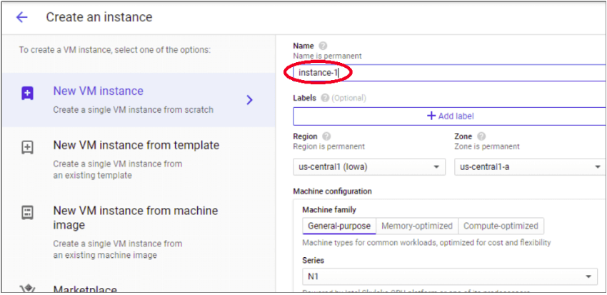
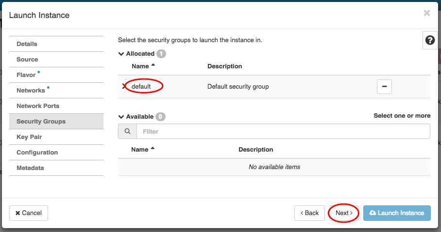

**Introduction**

DRIVER 2.0 platform has deployed and tested on Amazon Web Services (AWS), Google Cloud Platform (GCP), Microsoft Azure
and OpenStack. To host the platform, the first step is to create an instance. Below steps should be carried out on each
of the cloud platforms.

**Amazon Web Services (AWS)**

###### Create Your EC2 Resources and Launch Your EC2 Instance

Before you can launch and connect to an Amazon EC2 instance, you need to create a key pair, unless you already have one.
You can create a key pair using the Amazon EC2 console, and then you can launch your EC2 instance.

###### To create a key pair

Follow the steps in Setting Up with Amazon EC2 in the Amazon EC2 User Guide for Linux Instances to create a key pair. If
you already have a key pair, you don't need to create a new one. You can use your existing key pair for this exercise.

###### To launch the EC2 instance and mount an EFS file system

1. Open the Amazon EC2 console at https://console.aws.amazon.com/ec2/
2. Choose Launch Instance.
3. In Step 1: Choose an Amazon Machine Image (AMI), find an Amazon Linux AMI at the top of the list, and choose Select.
4. In Step 2: Choose an Instance Type, choose Next: Configure Instance Details.
5. In Step 3: Configure Instance Details, provide the following information:
   a. Leave Number of instances at one.
   b. Leave the Purchasing option at the default setting.
   c. For Network, choose the entry for the same VPC that you noted when you created your EFS file system in 
   Step 1: Create Your Amazon EFS File System. d. For Subnet, choose a default subnet in any Availability Zone. e. For 
   File systems, make sure that the EFS file system that you created in Step 1: Create Your Amazon EFS File System is 
   selected. The path shown next to the file system ID is the mount point that the EC2 instance will use, which you can 
   change. f. The User data automatically includes the commands for mounting your Amazon EFS file system.

6. Choose Next: Add Storage.
7. Choose Next: Add Tags.
8. Name your instance and choose Next: Configure Security Group.
9. In Step 6: Configure Security Group, set Assign a security group to Select an existing security group. Choose the
   default security group to make sure that it can access your EFS file system. You can't access your EC2 instance by
   Secure Shell (SSH) using this security group. SSH access isn't required for this exercise. To add access by SSH
   later, you can edit the default security and add a rule to allow SSH. Or you can create a new security group that
   allows SSH. You can use the following settings to add SSH access:
   a. Type: SSH b. Protocol: TCP c. Port Range: 22 d. Source: Anywhere 0.0.0.0/0
10. Choose Review and Launch.
11. Choose Launch.
12. Select the check box for the key pair that you created, and then choose Launch Instances.

After completing the above steps, please refer to the README.md file (in the root folder of the cloned github
repository) for the next steps, or you can refer below link for better understanding.

https://github.com/wb-driver/DRIVER2.0/blob/main/web-installation.md

**Google Cloud Platform (GCP)**

Follow the below steps to create a VM on GCP.

1. Log in to Google Cloud Console.
2. Click on ‘Navigation Menu’ and select ‘Compute Engine’ -> ‘VM instances’.

3. If you are creating the instance for the first time, you will be prompted to create a project. Each instance belongs
   to a Google Cloud Project, which can have one or more instances. Enter your project name (e.g., ‘My Project 73416’),
   select Billing Account, and click on the ‘Create’ button.

Or, if you already have a project, select it and continue.

4. Your selected project name will appear in the top bar of the screen. Click on the ‘Create’ button of the ‘Compute
   Engine – VM Instances’ pop-up window, and the ‘Create an instance’ screen will appear.

5. Type an instance name as an identifiable name for your instance (e.g., Instance 1).

6. Next, select the ‘Region’ and ‘Zone’. Please note that these are permanent settings and hence, need careful
   consideration while selecting them.

7. Select the required machine type based on your requirement and the table mentioned above. A General Purpose VM can
   work for Windows Server instance, which we are planning to create now. On the other hand, higher workloads such as
   databases demand memory-optimized VMs.

8. Select the ‘Boot Disk’ by selecting the required operating system. As we are creating ‘Windows Server’, click the
   ‘Change’ button.

From the ‘Boot Disk’ pop-up window, select the ‘Operating System’ as ‘Windows Server’ and ‘Version’ as ‘Windows Server
2019 Datacenter Core’ and click on the ‘Select’ button.

9. Select if you need API access and Firewall exceptions. These are optional choices. You can give access to your VM to
   a specific group, individual, or everyone in the organization. Application development primarily needs API access.
   The firewall settings will dictate whether the VM will be accessible via internet protocols HTTP and HTTPS.

10. Click on the ‘Create’ button. The VM creation and deployment process will take a couple of minutes.

**Microsoft Azure**

###### To create a SQL Managed Instance, follow these steps:

1. Sign in to the Azure portal
2. Select Azure SQL on the left menu of the Azure portal. If Azure SQL is not in the list, select All services, and then
   enter Azure SQL in the search box.
3. Select +Add to open the Select SQL deployment option page. You can view additional information about Azure SQL
   Managed Instance by selecting Show details on the SQL managed instances tile.
4. Select Create.

5. Use the tabs on the Create Azure SQL Managed Instance provisioning form to add required and optional information. The
   following sections describe these tabs.

###### Basics tab

1. Fill out mandatory information required on the Basics tab. This is a minimum set of information required to provision
   a SQL Managed Instance.
   

2. Select Configure Managed Instance to size compute and storage resources and to review the pricing tiers. Use the
   sliders or text boxes to specify the amount of storage and the number of virtual cores. When you're finished, select
   Apply to save your selection.

3. To review your choices before you create a SQL Managed Instance, you can select Review + create. Or, configure
   networking options by selecting Next: Networking.

###### Networking tab

1. Fill out optional information on the Networking tab. If you omit this information, the portal will apply default
settings.

2. Select Review + create to review your choices before you create a managed instance. Or, configure more custom
   settings by selecting Next: Additional settings.

###### Additional settings

1. Fill out optional information on the Additional settings tab. If you omit this information, the portal will apply
   default settings.

Select Review + create to review your choices before you create a managed instance. Or, configure Azure Tags by
selecting Next: Tags (recommended).

###### Tags

1. Add tags to resources in your Azure Resource Manager template (ARM template). Tags help you logically organize your
   resources. The tag values show up in cost reports and allow for other management activities by tag.
2. Consider at least tagging your new SQL Managed Instance with the Owner tag to identify who created, and the
   Environment tag to identify whether this system is Production, Development, etc. For more information, see Develop
   your naming and tagging strategy for Azure resources.
3. Select Review + create to proceed.

###### Review + create

1. Select Review + create tab to review your choices before you create a managed instance.

2. Select Create to start provisioning the managed instance.

###### Monitor deployment progress

1. Select the Notifications icon to view the status of the deployment.

2. Select Deployment in progress in the notification to open the SQL Managed Instance window and further monitor the
   deployment progress.

###### View resources created

Upon successful deployment of a managed instance, to view resources created:

1. Open the resource group for your managed instance.

###### View and fine-tune network settings

To optionally fine-tune networking settings, inspect the following:

1. In the list of resources, select the route table to review the user-defined Route table (UDR) object that was
   created.
2. In the route table, review the entries to route traffic from and within the SQL Managed Instance virtual network. If
   you create or configure your route table manually, create these entries in the SQL Managed Instance route table.

To change or add routes, open the Routes in the Route table settings.
3. Return to the resource group, and select the network security group (NSG) object that was created.
4. Review the inbound and outbound security rules.

To change or add rules, open the Inbound Security Rules and Outbound security rules in the Network security group
settings.

###### Retrieve connection details to SQL Managed Instance

To connect to SQL Managed Instance, follow these steps to retrieve the host name and fully qualified domain name (FQDN):

1. Return to the resource group and select the SQL managed instance object that was created.
2. On the Overview tab, locate the Host property. Copy the host name to your clipboard for the managed instance for use
   in the next quickstart by clicking the Copy to clipboard button.
   

The value copied represents a fully qualified domain name (FQDN) that can be used to connect to SQL Managed Instance. It
is similar to the following address example: your_host_name.a1b2c3d4e5f6.database.windows.net.

**OpenStack**

###### To create an instance using OpenStack, follow the below steps:

1. Click on ‘Compute’ >> ‘Instances’ and then on ‘Launch Instance’.

2. Select your zone and click on ‘Next’.

3. You are now in the ‘Sources’ section. Select an OS for your instance from the ‘+’ button and click on ‘Next’ again.

4. In ‘Flavor’ you select the scale of the virtual machine. When you decide on the capacity you need, click on the ‘+’
   button and then on ‘Next’ again.
   

5. In ‘Networks’ select your default Private network.

6. In ‘Network Ports’ you can associate an IP address with a port.

7. In ‘Security Groups’ you can manage the group of filter rules applied to the instance. We have already prepared by
   adding Port 80 to the Default security group.

8. In ‘Key Pair’ make sure the key pair you want to use is under ‘Allocated’ and not under ‘Available’. WARNING: Please
   note this step is not optional. If you do not allocate at least one key pair, you will not be able to access the
   instance in any way. With the original instance you can connect to the instance and, if you need to, add extra public
   keys via ./ssh.
   

9. In ‘Configuration’ you can keep the default settings.

10. In ‘Metadata’ you can keep the default settings.

11. Click on ‘Launch Instance’ at the bottom of the pop-up to create your machine. Give it a minute to process and it is
    ready for work.