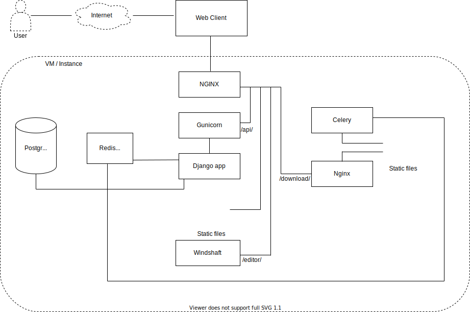

# System administration and troubleshooting

The goal of this document is to provide enough information to allow a system administrator to set up and maintain a production DRIVER2.0 system, and to aid in troubleshooting if something goes wrong.

These instructions are designed to be run on a Linux- or Unix-like system.


## Sections
- [**General system architecture**](#general-system-architecture)
- [**Deployment**](#deployment)
- [**DNS setup**](#dns-setup)
- [**Deploying updates**](#deploying-updates)
- [**Making custom changes**](#making-custom-changes)
- [**Firewall configuration**](#firewall-configuration)
- [**SSL certificate configuration**](#ssl-certificate-configuration)
- [**Cleaning up after Docker**](#cleaning-up-after-docker)
- [**General troubleshooting notes for server restarts**](#general-troubleshooting-notes-for-server-restarts)

## General system architecture

The default DRIVER2.0 production setup consists of following servers, all running Ubuntu 18.04 LTS:

   * [PostgreSQL](https://www.postgresql.org/) database for storing data
   * [Redis](http://redis.io/) service for caching temporary data
   * [Django](https://www.djangoproject.com/) application backend
   * [Nginx](https://www.nginx.com/) web proxy for routing requests
   * [Gunicorn](http://gunicorn.org/) for interfacing between `Nginx` and `Django`
   * [Windshaft](https://github.com/CartoDB/Windshaft) for serving map tiles
   * `Nginx` web proxy for serving file downloads
   * [Celery](http://www.celeryproject.org/) workers for processing asynchronous and batch requests

Each of these servers also includes:
   * Firewall configuration via [ufw](https://help.ubuntu.com/community/UFW)
   * Logs for each locally running service, see [logging.md](logging.md) for details



## Deployment
### 1. Initial setup

Using whatever computing resources are available to you, set up a blank server running Ubuntu 18.04. Amazon Web Services (AWS) is the preferred way to set up the server, but other cloud providers such as Microsoft Azure, Google Cloud Platform (GCP), OpenStack should work as well. If you have physical servers provided by your IT department, they will also work.

Based on the user activity, we need to select the appropriate configuration of the server. For example, if there is a large number of users accessing this server, then a server with high configuration needs to be taken. Also, the security groups (i.e. 80, 8080, 5432, 8000, 22, 6379, 3200, 443 ) need to be added after creating the instance.

If you are using AWS, make sure you have SSH access to the servers via an identity file before proceeding. For example, if your server is in AWS or Microsoft Azure, you will need the .pem Identity file that grants access. See here for instructions on creating this file for AWS or Microsoft Azure.

For the server, note down:
   The public IP address used to access the server via SSH.
   (If applicable) The server's private IP address. This is likely to apply if the server is running in a cloud provider such as AWS or Microsoft Azure.

If your server is in GCP, select the appropriate project and identify the VM instance from the Compute Engine in the left side navigation bar. Select the required instance and click on SSH. This will allow direct access to the server.


#### CloudFormation
To launch the DRIVER2.0 instances in an AWS account, follow these steps:
1. Log into the AWS console and navigate to the CloudFormation service console.
2. Click `Create Stack`
3. Under `Choose a template`, select `Upload a template to Amazon S3` and choose `deployment/demo-cfn-template.yaml` under the project directory. Click `Next`.
4. On the `Specify Details` screen, fill in the requested parameters. In a production scenario with many users, we recommend using at least `t2.large` instances, but `t2.medium` instances will work fine if you are not anticipating a lot of user activity. For `KeyName`, enter the name of the key pair you created previously. For `NameSuffix`, enter a short name that will help you remember the purpose of the servers that will be launched. Click `Next`.
5. On the `Options` screen you should not need to make any changes. Click `Next`.
6. On the `Review` screen, review the parameters you have entered. If everything looks good, click `Create`.
7. Once your DRIVER2.0 instances have been launched, note down their public and private IP addresses and continue with the deployment process. You can find this information by clicking the `Resources` tab after the stack is up. You can then select an instance by its `Physical ID`. The public and private IPs will be shown under the "Description" tab at the bottom of the page.


### DNS Setup

Determine the domain name at which you plan to make your DRIVER2.0 instance accessible (e.g. roadsafety.io). Use your DNS management system to create an A record which directs the DRIVER2.0 domain name to the IP address of server you plan to use as the **App** host (see above).

A domain name is necessary for DRIVER2.0 to function correctly. If you do not have a domain name available, you should follow the instructions in `README.md` to set up a local development instance of DRIVER2.0, and use that until you can obtain a domain name.

### 3. Configuration files

When checking out the source code, make sure to checkout the branch that you want to deploy. The list of valid branches can be found [here](https://github.com/hsarbas/DRIVER2.0). To do this, run `git fetch --all && git checkout branch/<version>`.


### 4. Deploy

Once the **group-vars** and **inventory** files are in place, deployment may be performed by opening a terminal, switching to the directory of the DRIVER2.0 source code and running the following command (NOTE: Make sure to change the `--user` argument to a user that has sudo privileges on those servers):
```
ansible-playbook -i deployment/ansible/inventory/production --user=ubuntu \
    deployment/ansible/database.yml \
    deployment/ansible/app.yml \
    deployment/ansible/celery.yml
```

When running this command, you may see messages of the form `The authenticity of host '...' can't be established`. If so, type `yes` and hit Enter. You may have to do this several times before provisioning will begin. If you nonetheless receive an error like `fatal: [app]: UNREACHABLE! =>{"changed": false, "msg": "Failed to connect to the host via ssh: Host key verification failed.`, just re-run the command.

The following are links to the `Ansible` documentation for an in-depth description of how to use inventories and variables:
 * [Ansible inventory documentation](http://docs.ansible.com/ansible/intro_inventory.html)
 * [Ansible variables documentation](http://docs.ansible.com/ansible/playbooks_variables.html)

## Deploying updates

To deploy updates or make changes to the application, follow these steps:

* Whenever there are any Django or backend API changes, take a pull on the server. And to reflect these changes on the docker container, you will have to rebuild the docker container. 
  
* Rebuild the fixed container using `docker build -t {container_name}  .` command.

* You will need to maintain Docker containers so that the project will be deployed using the Docker container.

* Re-run the `docker-compose up -d` command.

* Incase if you are changing the environment variables, repeat steps 2,3 and 4 so as to reflect the environment variables.


## Making custom changes

The code for the DRIVER is open-source, which makes it possible for any software developer to alter the software's functionality, fix bugs, and add features.

If you have software development resources available to make these types of changes, you are encouraged to submit pull requests to the DRIVER repository so that all DRIVER users can benefit.

However, if you want to deploy your changes to your production version of DRIVER before they are incorporated into the main repository, you will need to maintain Docker containers so that the project will be deployed using the Docker container.


## Logging into servers and viewing logs

`ssh -i <location of ssh identify file> <username>@<server IP>`

Once logged into the desired server, the log files may be examined by using `tail`, `nano`, `vim`, or any other desired method of viewing log content. See [logging.md](logging.md) for detailed information of where specific log files are located. Examination of the log files will most likely lead to the underlying problem which will need to be fixed. Once the problem has been fixed, the failing service may be restarted by either using `Monit`, as described above, or by restarting the service manually via the `service` command. For example, restarting `nginx` can be done by executing the command: `sudo service nginx restart`. Many of the custom services running in `DRIVER2.0` start with the `driver-` prefix, and can be found by running the command `docker ps`. If after that command is run, the containers shown as stopped, and needs to be restarted, the command to do so would be: `sudo docker-compose up -d`.


## Firewall configuration

Each server has firewall rules applied which limit access by IPs and ports. The current firewall configuration can be viewed by running the command `sudo ufw status`. If any server IPs are modified, the firewall rules will need to be updated as well. This may be done manually via `ufw` commands, but the best way to accomplish this is probably updating the firewall IP address configuration in the `production` group_vars file and running the deployment script. The current firewall rules are as follows:

 * App host - http[s] is allowed
 * Celery host - http[s] is allowed only from App host servers (e.g. for CSV downloads)
 * Database host - PostgreSQL and redis connections are allowed from App and Celery hosts.
 * SSH is allowed
 * Everything else is blocked

In order to diagnose issues with the firewall, it may be necessary to disable it temporarily. This may be done with the command: `sudo ufw disable`. And it may be re-enabled with the command `sudo ufw enable`.


## SSL certificate configuration

The web server is configured with an SSL certificate which has been automatically obtained using [letsencrypt](https://letsencrypt.org/). This certificate is valid for a period of 90 days, at which point a new SSL certificate must be obtained. There is a `cron` task on the App host which does this automatically. It runs once per day, and checks the age of the certificate. Once it is 60 days old, the certificate will be renewed. This should happen automatically, but if it doesn't happen, users of the application will start to see invalid SSL certificate warnings in their browsers.

In the case of a problem, the cron task should be checked. This can be examined by running the commands:
```
sudo crontab -l
```

There should be an entry for `certbot renew`. That command may be run manually as the root user in order to help diagnose an error with SSL certification renewal.


## Cleaning up after Docker

[Docker](https://www.docker.com/) is used in several places with the DRIVER2.0 system to keep services separated out and running in their own containers. `Docker` keeps around old cached layers, which take up a lot of disk space. If the disk is getting low, it may be helpful to clear this cache. This can be done by executing the commands:
```
sudo su -
docker images --no-trunc| grep none | awk '{print $3}' | xargs -r docker rmi
```

This is helpful as a short-term workaround for clearing up some disk space, but if it is encountered, it probably means it's a good time to allocate more space to the disk.


## General troubleshooting notes for server restarts

There are a couple different ways in which the DRIVER2.0 system has been deployed. The preferred way to deploy the system is within Amazon Web Services (AWS), however it may also be deployed within a local server cluster. When using AWS, the machines are generally more reliable, and won't suffer from any amount of sporadic downtime.

AWS also has the concept of Security Groups, which allows the administrator to easily configure fine-grained access control rules. For example, the Database and Celery machines are typically set up to restrict port-specific traffic to only the App machine. This means that services such as PostgreSQL and Redis cannot be publicly accessed.

In an environment without Security Groups, a firewall must be configured on each machine to allow such restrictions. The firewall that comes configured with DRIVER2.0 by default is called UFW. The following is a set of general troubleshooting steps that may be performed when the servers are rebooted and the application no longer seems to behaving properly.


### 2. Ensure driver-app is running

```
Restarting Docker can be performed by running:
```
service docker restart
```

### 5. Verify the application is functioning

All services should now be running, reporting valid status, and showing good log messages: UFW and Docker are running on each machine, `driver-app` is running on the App machine, `driver-celery` is running on the Celery machine, and Redis is running on the Database machine.

Log into the web application, view the Dashboard, the Record List page, and the Map page to ensure records are displaying properly in each of the pages. Then attempt to perform a CSV export on the Map page. If it completes successfully, then the app is back in a functional state. If it times out, log into the Celery machine to see if jobs are processing. Follow the log file with:
```
tail -f /var/log/upstart/driver-celery.log
```
Hopefully there are some jobs processing, demonstrated by recent log messages such as:
```
[2019-04-29 23:37:33,329: INFO/MainProcess] Task data.tasks.export_csv.export_csv[e2362482-d2e4-4e99-b9b7-a91139081026] succeeded in 18.213758655s: 'Incidents-fb7a618b.zip'
```
Depending on how long the application has been down for, there may be a backlog of jobs for the system to churn through. Wait until the amount of processing tasks depletes, and then try another CSV export. It should now succeed.

If the log file is showing errors, consult the above steps, and check to make sure all of the required services are running, are returning good statuses, and there are no errors in any of the mentioned log files.
