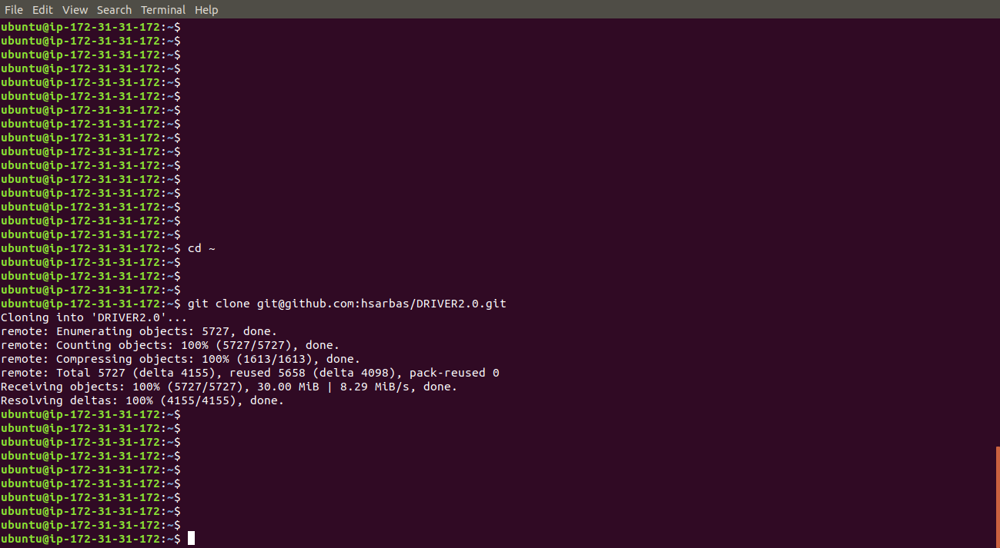

****DRIVER2.0 Installation Guide for Ubuntu 18.04****

To install DRIVER2.0 on your local/remote machine It is necessary to have a **github account with ssh key set up**

After creating github account you can follow below steps to set up ssh key

    ssh-keygen

Press enter to accept the default key and path

Enter and re-enter a passphrase when prompted.

    cat .ssh/id_rsa.pub (in case not default change the path after cat)

###### Copy the ssh key

**login to github** -> **click your avatar** -> **settings** -> under **Account settings** select **SSH and GPG keys**
click on **New SSH key** button **paste the copied key** inside **key** textarea click on **Add SSH key**

**1. After setting up ssh key take clone using below commands.**

    cd ~
    git clone git@github.com:hsarbas/DRIVER2.0.git

###### The command should clone the github repository

**2. Run production.sh from driver_new_tech which will take the clone of backend as well as front-end repositories and
install all the required prerequisites.**

    cd driver_new_tech
    sudo bash production_host.sh

###### This script will download all the necessary pre-requisites to run DRIVER 2.0 and also clone the code for front-end and backend

**3. Environment**

**You must define the constant values in the .env file. A template .env.sample is provided which contains the keys and
values required to run DRIVER2.0**

*Create .env file in the project directory. Refer a template .env.sample and follow steps below:*

    cd /var/www/driver_new_tech/
    sudo nano .env
    save and close the file

###### This command will create .env file which contains the keys and values required to run DRIVER2.0

**4. In the project directory(/var/www/driver_new_tech/) execute below step, as a superuser:**

    docker-compose up -d

###### The command should install the necessary packages and shall start all the docker container. i.e driver-new-tech, database, windshaft, driver-celery, redis-server.

**5. Review the containers using below command**

    docker ps

###### This command will return the list of running docker containers.

**6. Execute the configure.sh file using below commands.**

    cd /var/www/driver_new_tech/
    ./configure.sh

###### Enter username and password for superuser

###### This script will do migrations for all the apps, collect static files necessary for django admin panel and pass ip's of each container to the nginx server 

###### and create superuser.

**8. Creating Initial Dataset**

Execute the below command to create initial dataset. "driver-new-tech" is a name of docker container you can replace it 
by yours(in case modified).

    docker exec "driver-new-tech" ./manage.py create_dataset

###### This script will create necessary initial dataset such as groups, user details, Country etc.

**7. Create Incident and Intervention schema using below commands.**

    docker exec "driver-new-tech" python ./scripts/load_incident_schema.py --authz 'Token 0af6fba5c87d6335c61c5981007ed385e094bd39' --api-url 'http://{{ip_addr/domain_name}}/api'
    
    docker exec "driver-new-tech" python ./scripts/load_intervention_schema.py --authz 'Token 36df3ade778ca4fcf66ba998506bdefa54fdff1c' --api-url 'http://{{ip_addr/domain_name}}/api'

**8. Add English language for both Admin&User panel using below command.**

    python ./scripts/load_default_languages.py --authz 'Token 36df3ade778ca4fcf66ba998506bdefa54fdff1c' --api-url 'http://{{ip_addr/domain_name}}/api'

###### These commands will create incident and intervention schema and English language will be added for both User Panel and Ashlar Editor

**Admin Panel**

    sudo nano /var/www/wb-driver-admin-front-end-angular/dist/web-driver-admin/index.html
    change <app-root hostname = "http://{{ip_addr/domain_name}}/"> to running ip ip_addr/domain_name

###### API Host will be changed for Ashlar Editor

**User Panel**

    sudo nano /var/www/wb-driver-userpanel_front-end/dist/WB-Driver/index.html
    change <app-root hostname = "http://{{ip_addr/domain_name}}/" windshaftUrl = "http://{{ip_addr/domain_name}}"></app-root> to running ip_addr/domain_name

###### API Host will be changed for User Panel

**Link for accessing User & Admin panel:**

**User panel** "http://{{ip_addr/domain_name}}/"

**Admin panel** "http://{{ip_addr/domain_name}}/editor/"

Once the user is logged in into the Ashlar Editor, they first need to add the shapefiles for the city and region. To do
so, the user should follow the following steps:

All Geography -> Add New Geography -> (for City/Province)
Geography Label -> City/Province Display Field (select after upload) -> name (this will only be enabled when the user
saves the label, file, and Geography Color)
Geography Color -> red All Geography -> Add New Geography -> (for Regions)
Geography Label -> Regions Display Field (select after upload) -> region (this will only be enabled when the user saves
the label, file, and Geography Color)
Geography Color -> red

Once all the permissions are set, the user needs to “Add New Record Type”. The 2 record types are Incident and
Intervention. This can be done, by All Record Types -> Add a new record type. Single Title -> Incident Plural Title ->
Incidents Description -> Historical incident data

Single Title -> Intervention Plural Title -> Interventions Description ->Actions to improve traffic safety

[comment]: <> (![AddNewGeography]&#40;images/AshlarEditor_ManageUsers.png&#41;)

[comment]: <> (Manage User -> Add New User;)

[comment]: <> (Fill-up all the relevant details and click on *Create User* button.)

[comment]: <> (![AddNewGeography]&#40;images/AshlarEditor_CreateUser.png&#41;)

[comment]: <> (Manage Permissions -> Add Group Permission;)

[comment]: <> (Fill-up all the relevant details and click on *Save* button.)

[comment]: <> (![AddNewGeography]&#40;images/AshlarEditor_ManagePermissions.png&#41;)

[comment]: <> (To add new language, click on Language -> Add New Language. Add all the required details and click on *Save* button.)

[comment]: <> (![AddNewGeography]&#40;images/AshlarEditor_AddNewLanguage.png&#41;)

[comment]: <> (To add new Weather API Provider, click on Settings -> Weather API -> Add API Provider.)

[comment]: <> (Add PROVIDER NAME,  CLIENT ID / API KEY, CLIENT SECRET and click on *Save* button.)

[comment]: <> (![AddNewGeography]&#40;images/AshlarEditor_AddWeatherAPIProvider.png&#41;)

[comment]: <> (![AddNewGeography]&#40;images/AshlarEditor_AllCrashTypes.png&#41;)

[comment]: <> (Select Weather -> Settings -> SelectWeather;)

[comment]: <> (By default all the options are selected and same will appear in user panel, but if you do not want to show some )

[comment]: <> (of them then you can always uncheck those and click on *Save* button.)

[comment]: <> (![AddNewGeography]&#40;images/AshlarEditor_SelectWeather.png&#41;)

[comment]: <> (Bulk Upload)

[comment]: <> (To upload Incidents/Interventions in bulk, click on Settings -> Bulk Upload -> Upload Bulk Data, select Incident/)

[comment]: <> (Intervention from drop-down choose the relevant Json/csv file to upload. Once file is added, click on Upload button.)

[comment]: <> (If required you can download a sample file by clicking on "Download Sample file".)

[comment]: <> (![AddNewGeography]&#40;images/AshlarEditor_BulkUpload.png&#41;)

[comment]: <> (![AddNewGeography]&#40;images/UserPanel_CreateUser.png&#41;)

[comment]: <> (![AddNewGeography]&#40;images/Dashboard.png&#41;)

[comment]: <> (![AddNewGeography]&#40;images/MapPage.png&#41;)

[comment]: <> (![AddNewGeography]&#40;images/MapGraphs.png&#41;)

[comment]: <> (![AddNewGeography]&#40;images/AddIncident.png&#41;)

[comment]: <> (![AddNewGeography]&#40;images/AddIncident_Preview.png&#41;)

[comment]: <> (![AddNewGeography]&#40;images/RecordList.png&#41;)

[comment]: <> (![AddNewGeography]&#40;images/BarGraph.png&#41;)

[comment]: <> (![AddNewGeography]&#40;images/PieChart.png&#41;)